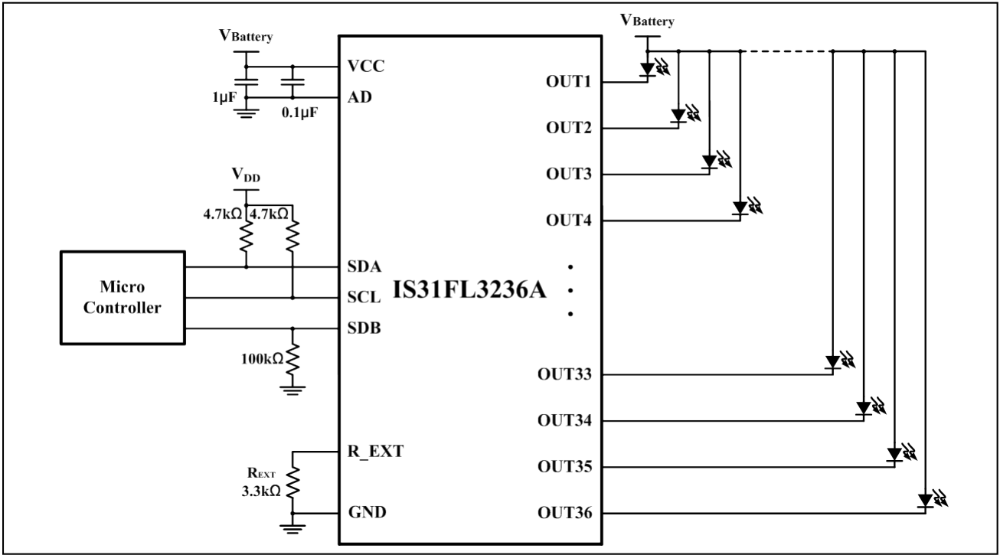

## **36 CHANNEL LED DRIVER; SELECTABLE PWM FREQUENCY** 

### **GENERAL DESCRIPTION** 

IS31FL3236A is comprised of 36 constant current channels each with independent PWM control, designed for driving LEDs, PWM frequency can be 3kHz or 22kHz. The output current of each channel can be set at up to 38mA (Max.) by an external resistor and independently scaled by a factor of 1, 1/2, 1/3 and 1/4. The average LED current of each channel can be changed in 256 steps by changing the PWM duty cycle through an I2C interface. 

The chip can be turned off by pulling the SDB pin low or by using the software shutdown feature to reduce power consumption. 

IS31FL3236A is available in QFN-44 (5mm × 5mm) package. It operates from 2.7V to 5.5V over the temperature range of -40°C to +85°C. 

### **FEATURES** 

- 2.7V to 5.5V supply 

- I2C interface, automatic address increment function 

- Four selectable I2C addresses 

- Internal reset register 

- Modulate LED brightness with 256 steps PWM 

- Each channel can be controlled independently 

- Each channel can be scaled independently by 1, 1/2, 1/3 and 1/4 

- PWM frequency selectable 

   - 3kHz (default) 

   - 22kHz 

- -40°C to +85°C temperature range 

- QFN-44 (5mm × 5mm) package 

### **APPLICATIONS** 

- Mobile phones and other hand-held devices for LED display 

- LED in home appliances 

### **TYPICAL APPLICATION CIRCUIT** 

**Figure 1** Typical Application Circuit 

**Note 1:** The maximum global output current is set to 23mA when REXT = 3.3kΩ. Please refer Page 10 for setting LED current. 

