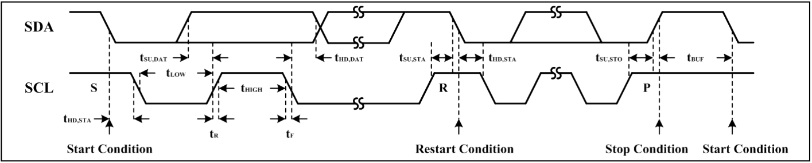

### **DETAILED DESCRIPTION** 

### **I2C INTERFACE** 

The IS31FL3236A uses a serial bus, which conforms to the I2C protocol, to control the chip’s functions with two wires: SCL and SDA. The IS31FL3236A has a 7-bit slave address (A7:A1), followed by the R/W bit, A0. Since IS31FL3236A only supports write operations, A0 must always be “0”. The value of bits A1 and A2 are decided by the connection of the AD pin. 

The complete slave address is: 

**Table 1  Slave Address (Write only):** 

AD connected to GND, AD = 00; 

AD connected to VCC, AD = 11; 

AD connected to SCL, AD = 01; 

AD connected to SDA, AD = 10; 

The SCL line is uni-directional. The SDA line is bi-directional (open-collector) with a pull-up resistor (typically 4.7kΩ). The maximum clock frequency specified by the I2C standard is 400kHz. In this discussion, the master is the microcontroller and the slave is the IS31FL3236A. 

The timing diagram for the I2C is shown in Figure 2. The SDA is latched in on the stable high level of the SCL. When there is no interface activity, the SDA line should be held high. 

The “START” signal is generated by lowering the SDA signal while the SCL signal is high. The start signal will alert all devices attached to the I2C bus to check the incoming address against their own chip address. 

The 8-bit chip address is sent next, most significant bit first. Each address bit must be stable while the SCL level is high. 

After the last bit of the chip address is sent, the master checks for the IS31FL3236A’s acknowledge. The master releases the SDA line high (through a pull-up resistor). Then the master sends an SCL pulse. If the IS31FL3236A has received the address correctly, then it holds the SDA line low during the SCL pulse. If the SDA line is not low, then the master should send a “STOP” signal (discussed later) and abort the transfer. 

Following acknowledge of IS31FL3236A, the register address byte is sent, most significant bit first. IS31FL3236A must generate another acknowledge indicating that the register address has been received. 

Then 8-bit of data byte are sent next, most significant bit first. Each data bit should be valid while the SCL level is stable high. After the data byte is sent, the IS31FL3236A must generate another acknowledge to indicate that the data was received. 

The “STOP” signal ends the transfer. To signal “STOP”, the SDA signal goes high while the SCL signal is high. 

### **ADDRESS AUTO INCREMENT** 

To write multiple bytes of data into IS31FL3236A, load the address of the data register that the first data byte is intended for. During the IS31FL3236A acknowledge of receiving the data byte, the internal address pointer will increment by one. The next data byte sent to IS31FL3236A will be placed in the new address, and so on. The auto increment of the address will continue as long as data continues to be written to IS31FL3236A (Figure 5). 

**Figure 2** Interface Timing 

**Figure 3** Bit Transfer

## Structured tables

- [The complete slave address is: Table 1 Slave Address (Write only):](../tables/page-06-the-complete-slave-address-is-table-1-slave-address-write-only.yaml)
