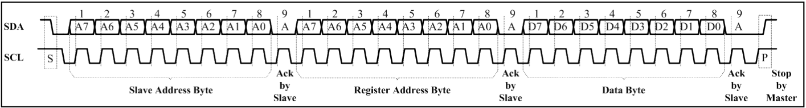
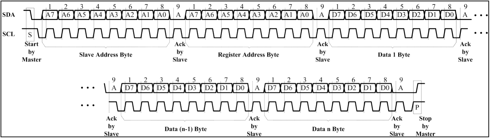
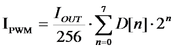
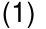

**Figure 4** Writing to IS31FL3236A (Typical) 

**Figure 5** Writing to IS31FL3236A (Automatic Address Increment) 

### **REGISTERS DEFINITIONS Table 2  Register Function** 

**Table 3  00h  Shutdown Register** 

**Table 4  01h~24h  PWM Register (OUT1~OUT36)** 

The Shutdown Register sets software shutdown mode of IS31FL3236A. 

**SSD** Software Shutdown Enable 

0 Software shutdown mode 1 Normal operation 

The PWM Registers adjusts LED luminous intensity in 256 steps. 

The value of a channel’s PWM Register decides the average output current for each output, OUT1~OUT36. The average output current may be computed using the Formula (1): 

Where “n” indicates the bit location in the respective PWM register.

## Structured tables

- [REGISTERS DEFINITIONS Table 2 Register Function](../tables/page-07-registers-definitions-table-2-register-function.yaml)
