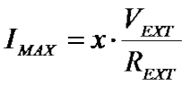
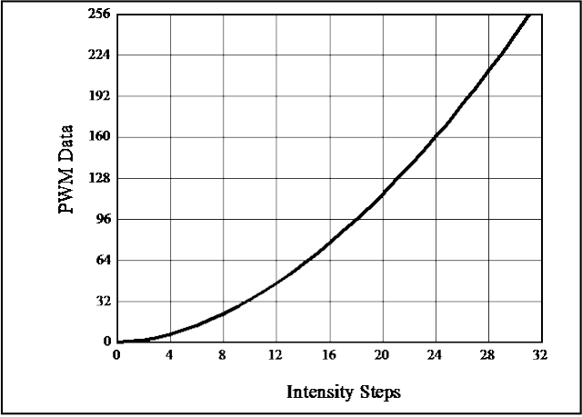

### **TYPICAL APPLICATION** 

### **PWM CONTROL** 

The PWM Registers (01h~24h) can modulate LED brightness of 36 channels with 256 steps. For example, if the data in PWM Register is “0000 0100”, then the PWM is the fourth step. 

Writing new data continuously to the registers can modulate the brightness of the LEDs to achieve a breathing effect. 

### **REXT** 

The maximum output current of OUT1~OUT36 can be adjusted by the external resistor, REXT, as described in Formula (2). 

(2) 

x = 58.5, VOUT = 0.8V, VEXT = 1.3V. 

The recommended minimum value of REXT is 2kΩ. 

### **CURRENT SETTING** 

The current of each LED can be set independently by the SL bit of LED Control Register (26h~49h). The maximum global current is set by the external register REXT. 

When channels drive different quantity of LEDs, adjust maximum output current according to quantity of LEDs to ensure average current of each LED is the same. 

For example, set REXT = 3.3kΩ then IMAX = 23mA. If OUT1 drives two LEDs and OUT2 drives four LEDs, set the SL bit of LED Control Register (26h) to “01” and SL bit of LED Control Register (27h) to “00”. So the current of OUT1 is IOUT1 = IMAX/2 = 11.5mA and the current of OUT2 is IOUT2 = IMAX = 23mA. The average current of each LED is the same. 

### **GAMMA CORRECTION** 

In order to perform a better visual LED breathing effect we recommend using a gamma corrected PWM value to set the LED intensity. This results in a reduced number of steps for the LED intensity setting, but causes the change in intensity to appear more linear to the human eye. 

Gamma correction, also known as gamma compression or encoding, is used to encode linear luminance to match the non-linear characteristics of display. Since the IS31FL3236A can modulate the brightness of the LEDs with 256 steps, a gamma correction function can be applied when computing each subsequent LED intensity setting such that the changes in brightness matches the human eye's brightness curve. 

**Table 8  32 Gamma Steps With 256 PWM Steps** 

**Figure 6** Gamma Correction (32 Steps) 

Choosing more gamma steps provides for a more continuous looking breathing effect. This is useful for very long breathing cycles. The recommended configuration is defined by the breath cycle T. When T=1s, choose 32 gamma steps, when T=2s, choose 64 gamma steps. The user must decide the final number of gamma steps not only by the LED itself, but also based on the visual performance of the finished product. 

**Table 9 64 Gamma Steps With 256 PWM Steps**

## Structured tables

- [Table 8 32 Gamma Steps With 256 PWM Steps](../tables/page-10-table-8-32-gamma-steps-with-256-pwm-steps.yaml)
- [product. Table 9 64 Gamma Steps With 256 PWM Steps](../tables/page-10-product-table-9-64-gamma-steps-with-256-pwm-steps.yaml)
