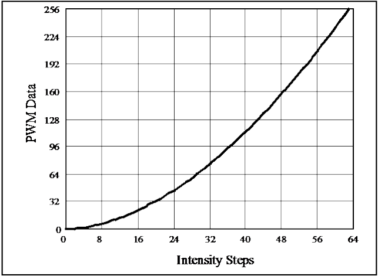
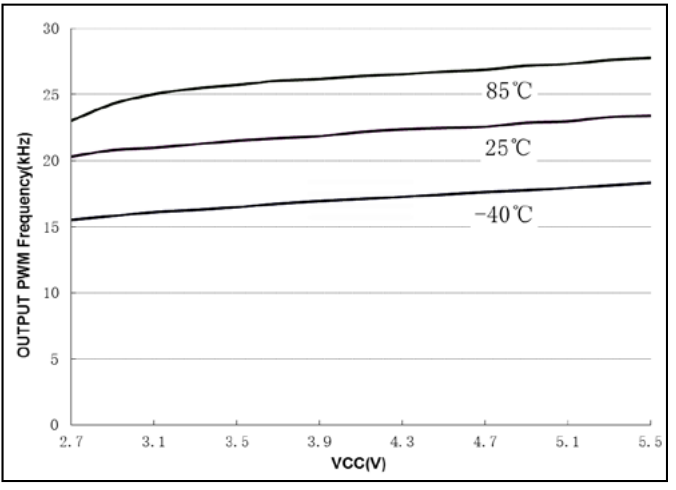

**Figure 7** Gamma Correction (64 Steps) 

Note, the data of 32 gamma steps is the standard value and the data of 64 gamma steps is the recommended value. 

### **SHUTDOWN MODE** 

Shutdown mode can be used as a means of reducing power consumption. During shutdown mode all registers retain their data. 

### **SOFTWARE SHUTDOWN** 

By setting SSD bit of the Shutdown Register (00h) to “0”, the IS31FL3236A will operate in software shutdown mode. When the IS31FL3236A is in software shutdown mode, all current sources are switched off. 

### **HARDWARE SHUTDOWN** 

The chip enters hardware shutdown mode when the SDB pin is pulled low. 

### **PWM FREQUENCY SELECT** 

The IS31FL3236 output channels operate with a default PWM frequency of 3kHz. Because all the OUTx channels are synchronized, the DC supply will 

experience large instantaneous current surges when the OUTx channels turn ON. These current surges will generate an AC ripple on the power supply which cause stress to the decoupling capacitors. 

When the AC ripple is applied to a monolithic ceramic capacitor chip (MLCC) it will expand and contract causing the PCB to flex and generate audible hum in the range of between 20Hz to 20kHz, To avoid this hum, there are many countermeasures, such as selecting the capacitor type and value which will not cause the PCB to flex and contract. 

An additional option for avoiding audible hum is to set the IS31FL3236’s output PWM frequency above the audible range. The Output Frequency Setting Register 4Bh bit D0 can be used to set the switching frequency to 22kHz, which is beyond the audible range. Figure 8 below shows the variation of output PWM frequency across supply voltage and temperature. 

**Figure 8** VCC vs. OUTPUT PWM Frequency 

