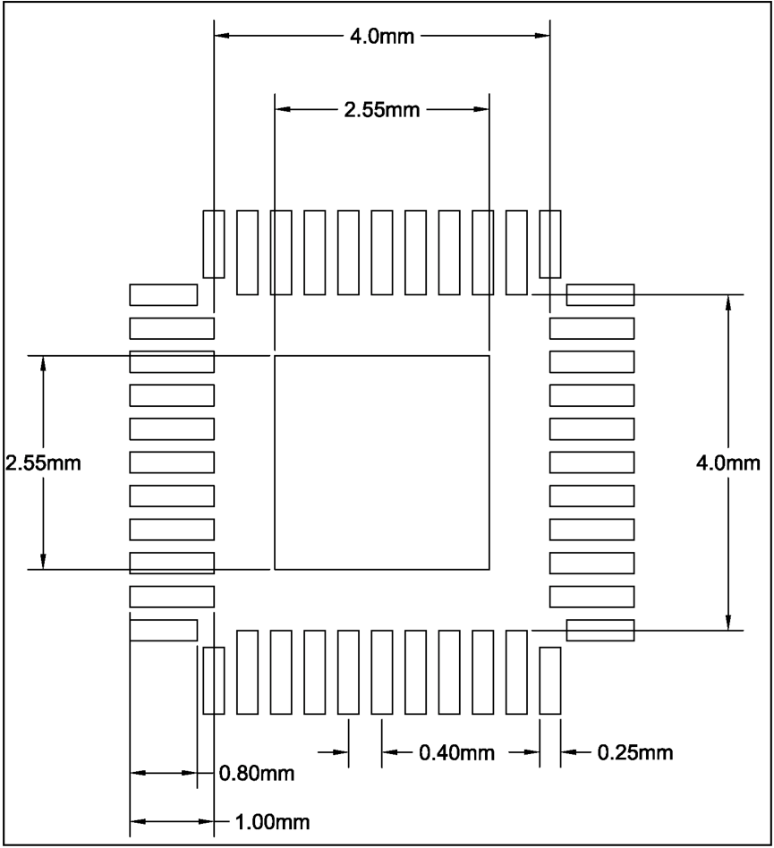

### **RECOMMENDED LAND PATTERN** 

### **QFN-44** 

#### **Note:** 

1. Land pattern complies to IPC-7351. 

2. All dimensions in MM. 

3. This document (including dimensions, notes & specs) is a recommendation based on typical circuit board manufacturing parameters. Since land pattern design depends on many factors unknown (eg. user’s board manufacturing specs), user must determine suitability for use. 

