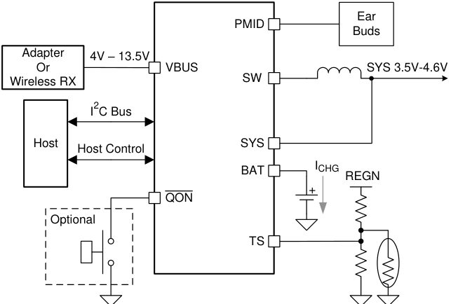

## **BQ25618/619 I****2** **C Controlled 1-Cell 1.5A Battery Charger with 20mA Termination and 1A Boost Operation** 

##### **1 Features** 

- Single chip solution to charge wearable accessories from adapter or battery 

- High-efficiency, 1.5MHz, synchronous switch-mode buck charger 

   - 95.5% charge efficiency at 0.5A and 94.5% efficiency at 1A 

   - ±0.5% charge voltage regulation (10mV step) 

   - I2 C programmable JEITA profile of charge voltage, current and temperature thresholds 

   - Low termination current with high accuracy 20mA±10mA 

   - Small inductor form factor of 2.5 x 2.0 x 1.0mm3 

- Boost mode with output from 4.6V to 5.15V 

   - 94% boost efficiency at 1A output 

   - Integrated control to switch between Charge and Boost mode 

   - PMID_GOOD pin control external PMOS FET for protection against fault conditions 

- Single input supporting USB input, high-voltage adapter, or wireless power 

   - Support 4V to 13.5V input voltage range with 22V absolute max input rating 

   - Programmable input current limit (IINDPM) with I2 C (100mA to 3.2A, 100mA/step) 

   - Maximum power tracking by input voltage limit (VINDPM) up to 5.4V 

   - VINDPM threshold automatically tracks battery voltage 

- Narrow VDC (NVDC) power path management 

   - System instant-on with no battery or deeply discharged battery 

- Flexible I2 C configuration and autonomous charging for optimal system performance 

- High integration includes all MOSFETs, current sensing and loop compensation 

- Low RDSON 19.5mΩ BATFET to minimize charging loss and extend battery run time 

   - BATFET control for Ship mode, and full system reset with and without adapter 

- 7µA low battery leakage current in Ship mode 

- 9.5µA low battery leakage current with system standby 

- High accuracy battery charging profile 

   - ±5% charge current regulation 

- Safety Related Certifications: – IEC 62368-1 CB Certification 

##### **2 Applications** 

- Consumer wearables, smartwatch 

- Personal care and fitness 

- Headsets/headphone 

- Earbuds (True Wireless or TWS) charging case 

- • Hearing aids charging case 

##### **3 Description** 

The BQ25618/619 integrates charge, boost converter and voltage protection in a single device. It offers the industry's lowest termination current for switching chargers to charge wearable devices by full battery capacity. The BQ25618/619 best-in-class low quiescent current reduces battery leakage down to 6uA in Ship mode, which conserves battery energy to double the shelf life for the device. The BQ25619 is in a 4mm × 4mm QFN package for easy layout. The BQ25618 is in a 2.0mm × 2.4mm WCSP package for space limited design. 

###### **Package Information** 

- (1) For all available packages, see Section 13. 

(2) The package size (length × width) is a nominal value and includes pins, where applicable. 

<!-- Start of picture text -->
Ear PMID Buds Adapter 4V ± 13.5V Or  VBUS SYS 3.5V-4.6V Wireless RX SW I 2 C Bus Host Host Control SYS BAT ICHG REGN QON + Optional TS <!-- End of picture text -->

- ±7.5% input current regulation 

- Remote battery sensing to charge faster 

###### **Simplified Application** 

- Programmable top-off timer for full battery charging

## Structured tables

- [space limited design. Package Information](../tables/page-01-space-limited-design-package-information.yaml)
