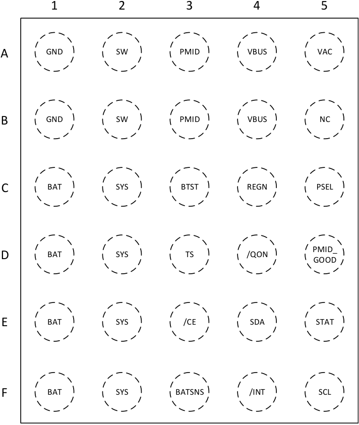
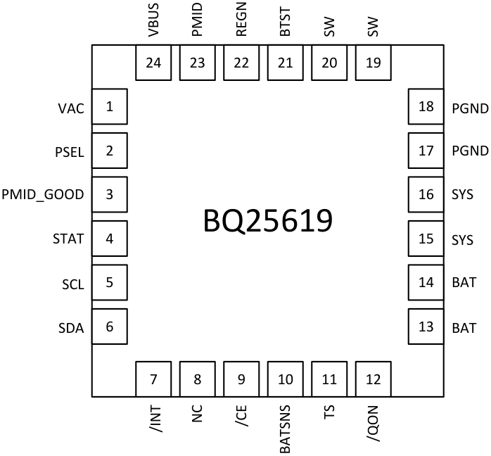

##### **5 Pin Configuration and Functions** 

<!-- Start of picture text -->
1                    2                    3                    4                    5 A GND SW PMID VBUS VAC B GND SW PMID VBUS NC C BAT SYS BTST REGN PSEL D BAT SYS TS /QON PMID_GOOD E BAT SYS /CE SDA STAT F BAT SYS BATSNS /INT SCL <!-- End of picture text -->

**Figure 5-1. BQ25618 YFF Package 30-Pin WCSP Top View** 

<!-- Start of picture text -->
24 23 22 21 20 19 VAC 1 18 PGND PSEL 2 17 PGND PMID_GOOD 3 16 SYS BQ25619 STAT 4 15 SYS SCL 5 14 BAT SDA 6 13 BAT 7 8 9 10 11 12 VBUS PMID REGN BTST SW SW /INT NC /CE BATSNS TS /QON <!-- End of picture text -->

**Figure 5-2. BQ25619 RTW Package 24-Pin WQFN Top View** 

