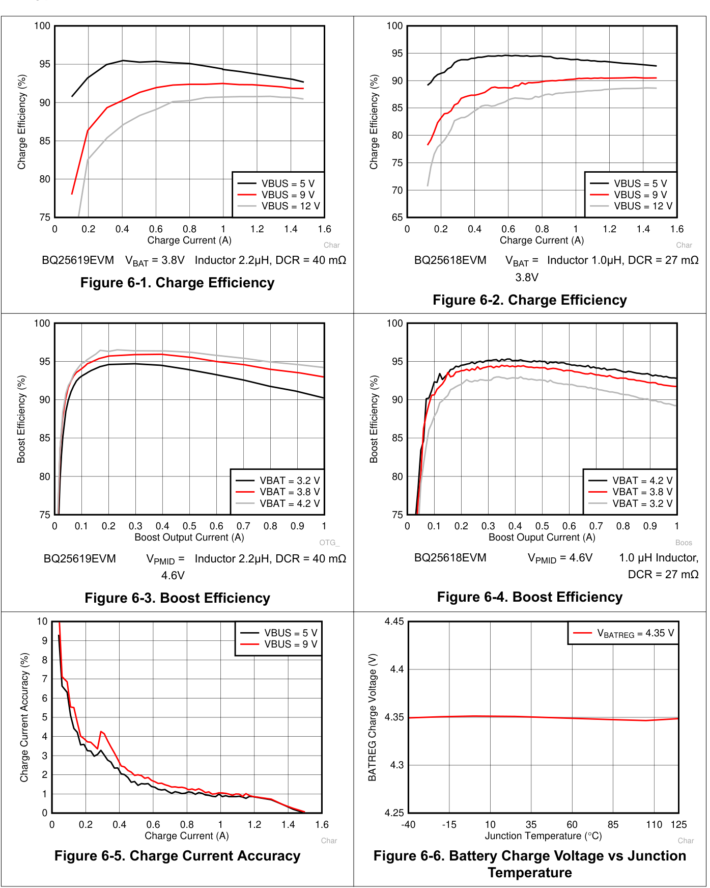

###### **6.8 Typical Characteristics** 

<!-- Start of picture text -->
100 100 95 95 90 90 85 80 85 75 80 VBUS = 5 V VBUS = 5 V 70 VBUS = 9 V VBUS = 9 V VBUS = 12 V VBUS = 12 V 75 65 0 0.2 0.4 0.6 0.8 1 1.2 1.4 1.6 0 0.2 0.4 0.6 0.8 1 1.2 1.4 1.6 Charge Current (A) Char Charge Current (A) Char BQ25619EVM VBAT = 3.8V Inductor 2.2µH, DCR = 40 mΩ BQ25618EVM VBAT =  Inductor 1.0µH, DCR = 27 mΩ 3.8V Figure 6-1. Charge Efficiency Figure 6-2. Charge Efficiency 100 100 95 95 90 90 85 85 80 VBAT = 3.2 V 80 VBAT = 4.2 V VBAT = 3.8 V VBAT = 3.8 V VBAT = 4.2 V VBAT = 3.2 V 75 75 0 0.1 0.2 0.3 0.4 0.5 0.6 0.7 0.8 0.9 1 0 0.1 0.2 0.3 0.4 0.5 0.6 0.7 0.8 0.9 1 Boost Output Current (A) OTG_ Boost Ouput Current (A) Boos BQ25619EVM VPMID =  Inductor 2.2µH, DCR = 40 mΩ BQ25618EVM VPMID = 4.6V 1.0 µH Inductor, 4.6V DCR = 27 mΩ Figure 6-3. Boost Efficiency Figure 6-4. Boost Efficiency 10 4.45 9 VBUS = 5 VVBUS = 9 V VBATREG = 4.35 V 8 4.4 7 6 5 4.35 4 3 4.3 2 1 0 4.25 0 0.2 0.4 0.6 0.8 1 1.2 1.4 1.6 -40 -15 10 35 60 85 110 125 Charge Current (A) Char Junction Temperature (qC) Char Figure 6-5. Charge Current Accuracy Figure 6-6. Battery Charge Voltage vs Junction Temperature Charge Efficiency (%) Charge Efficiency (%) Boost Efficiency (%) Boost Efficiency (%) Charge Current Accuracy (%) BATREG Charge Voltage (V) <!-- End of picture text -->

