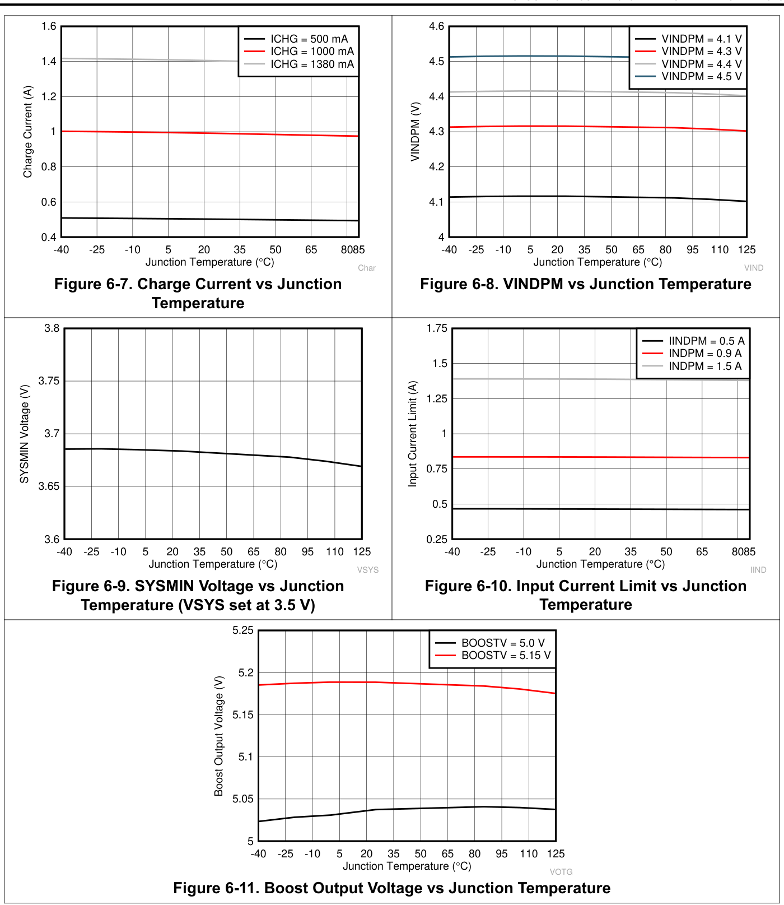

**www.ti.com** 

<!-- Start of picture text -->
1.6 4.6 ICHG = 500 mA VINDPM = 4.1 V ICHG = 1000 mA VINDPM = 4.3 V 1.4 ICHG = 1380 mA 4.5 VINDPM = 4.4 V VINDPM = 4.5 V 1.2 4.4 1 4.3 0.8 4.2 0.6 4.1 0.4 4 -40 -25 -10 5 20 35 50 65 8085 -40 -25 -10 5 20 35 50 65 80 95 110 125 Junction Temperature (qC) Char Junction Temperature (qC) VIND Figure 6-7. Charge Current vs Junction  Figure 6-8. VINDPM vs Junction Temperature Temperature 3.8 1.75 IINDPM = 0.5 A INDPM = 0.9 A 1.5 INDPM = 1.5 A 3.75 1.25 3.7 1 0.75 3.65 0.5 3.6 0.25 -40 -25 -10 5 20 35 50 65 80 95 110 125 -40 -25 -10 5 20 35 50 65 8085 Junction Temperature (qC) VSYS Junction Temperature (°C) IIND Figure 6-9. SYSMIN Voltage vs Junction  Figure 6-10. Input Current Limit vs Junction Temperature (VSYS set at 3.5 V) Temperature 5.25 BOOSTV = 5.0 V BOOSTV = 5.15 V 5.2 5.15 5.1 5.05 5 -40 -25 -10 5 20 35 50 65 80 95 110 125 Junction Temperature (qC) VOTG Figure 6-11. Boost Output Voltage vs Junction Temperature VINDPM (V) Charge Current (A) SYSMIN Voltage (V) Input Current Limit (A) Boost Output Voltage (V) <!-- End of picture text -->

