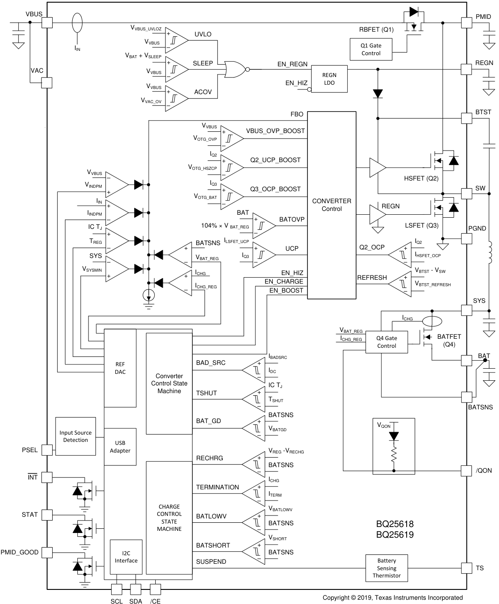

##### **7 Detailed Description** 

###### **7.1 Overview** 

The BQ25619/618 device is a highly integrated 1.5-A switch-mode battery charger for single cell Li-ion and Li-polymer battery. It includes an input reverse-blocking FET (RBFET, Q1), high-side switching FET (HSFET, Q2), low-side switching FET (LSFET, Q3), and battery FET (BATFET, Q4), and bootstrap diode for the high-side gate drive. 

###### **7.2 Functional Block Diagram** 

<!-- Start of picture text -->
VBUS PMID VVBUS_UVLOZ + UVLO RBFET (Q1) IIN VBAT + VVSLEEPVBUS ± Q1 Gate Control + SLEEP EN_REGN REGN VAC VVBUS ± REGN VVBUS EN_HIZ LDO + ACOV VVAC_OV ± FBO BTST VVBUS + VBUS_OVP_BOOST VOTG_OVP ± IQ2 + Q2_UCP_BOOST VVINDPMVBUSIIN ±++ VOTG_HSZCPVOTG_BATIQ3 ±+± Q3_OCP_BOOST CONVERTERControl REGN HSFET (Q2) SW IINDPM BAT ± + BATOVP IC TJ + 104% × V BAT_REG ± LSFET (Q3) PGND TREG ± + BATSNS ILSFET_UCP + UCP Q2_OCP + IQ2 SYS ± ± VBAT_REG IQ3 ± ± IHSFET_OCP VSYSMIN + + ICHG EN_HIZ REFRESH + VBTST - VSW ± ICHG_REG ENEN_CHARGE_BOOST ± VBTST_REFRESH SYS ICHG VBAT_REG ICHG_REG Q4 Gate  BATFET Control (Q4) IBADSRC BAT REF BAD_SRC + DAC IDC Converter  ± Control State Machine TSHUT + IC TJ TSHUT ± BATSNS BATSNS Input Source Detection USB BAT_GD +± VBATGD VQON PSEL Adapter VREG -VRECHG RECHRG + BATSNS ± /QON INT ICHG TERMINATION + ITERM ± CHARGE VBATLOWV STAT CONTROL BATLOWV + MACHINESTATE ± BATSNS BQ25618 VSHORT BQ25619 BATSHORT + PMID_GOOD InterfaceI2C SUSPEND ± BATSNS Battery Sensing  TS Thermistor SCL SDA /CE Copyright © 2019, Texas Instruments Incorporated <!-- End of picture text -->

