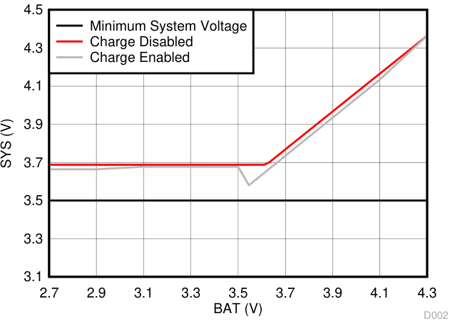

###### **_7.3.4 Boost Mode Operation From Battery_** 

The device supports boost converter operation to deliver power from the battery to other portable devices through a USB port. The output voltage is regulated at 5 V (programmable 4.6/4.75/5.0/5.15 V) and output current is up to 1 A. The user needs to have at least 350 mV between VBAT and Boost mode regulation voltage (VBST) to power up Boost mode reliably. For example, the BOOSTV[1:0] setting is recommended to be 4.75 V or higher if the battery voltage is 4.4 V. 

Boost operation is enabled if the conditions below are valid: 

1. Register setting: BATFET_DIS = 0, CHG_COFNIG = 0 and BST_CONFIG = 1 

2. BAT above VBST_BAT set by MIN_VBAT_SEL bit, 

3. VBUS less than VBAT + VSLEEP (in sleep mode) before converter starts. 

4. Voltage at TS (thermistor) pin, as a percentage of VREGN, is within acceptable range (VBHOT_RISE% < VTS% < VBCOLD_FALL%) 

During Boost mode, the status register VBUS_STAT bits are set to 111. 

The converter supports PFM operation at light load in Boost mode. The PFM_DIS bit can be used to disable PFM operation in boost configuration. 

The BQ25619/618 keeps the Q1 FET off during Boost mode. During adapter plug-in or removal, the charger automatically transitions between charging mode and Boost mode by setting the BST_CONFIG bit and CHG_CONFIG bit both to 1. When the adapter plugs in and the conditions to start a new charge cycle are valid, the device is in charging mode. If the adapter is removed and the boost enable conditions are valid, the device transits to Boost mode to power the accessories connected to PMID automatically. 

###### **_7.3.5 Power Path Management_** 

The device accommodates a wide range of input sources such as USB, wall adapter, or car charger. The device provides automatic power path selection to supply the system (SYS) from the input source (VBUS), battery (BAT), or both. 

###### **7.3.5.1 Narrow VDC Architecture** 

When the battery is below the minimum system voltage setting, the BATFET operates in linear mode (LDO mode), and the system is typically 180 mV above the minimum system voltage setting. As the battery voltage rises above the minimum system voltage, the BATFET is fully on and the voltage difference between the system and battery is the VDS of the BATFET. 

When battery charging is disabled and above the minimum system voltage setting or charging is terminated, the system is always regulated at typically 50 mV above the battery voltage. The status register VSYS_STAT bit goes to 1 when the system is in minimum system voltage regulation. 

<!-- Start of picture text -->
4.5 Minimum System Voltage 4.3 Charge Disabled Charge Enabled 4.1 3.9 3.7 3.5 3.3 3.1 2.7 2.9 3.1 3.3 3.5 3.7 3.9 4.1 4.3 BAT (V) D002 SYS (V) <!-- End of picture text -->

**Figure 7-1. System Voltage vs Battery Voltage** 

