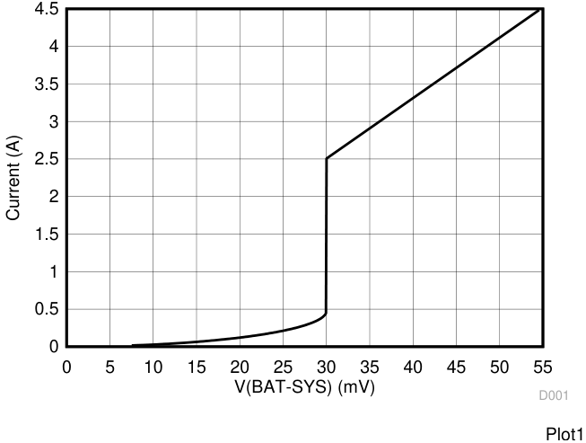

###### **7.3.5.2 Dynamic Power Management** 

To meet the maximum current limit in the USB specification and avoid overloading the adapter, the device features Dynamic Power Management (DPM), which continuously monitors the input current and input voltage. When input source is overloaded, either the current exceeds the input current limit (IINDPM) or the voltage falls below the input voltage limit (VINDPM). The device then reduces the charge current until the input current falls below the input current limit or the input voltage rises above the input voltage limit. 

When the charge current is reduced to zero, but the input source is still overloaded, the system voltage starts to drop. Once the system voltage falls below the battery voltage, the device automatically enters the supplement mode where the BATFET turns on and the battery starts discharging so that the system is supported from both the input source and battery. 

During DPM mode, the status register bits VINDPM_STAT or IINDPM_STAT go to 1. 

###### **7.3.5.3 Supplement Mode** 

When the system voltage falls below the battery voltage, the BATFET turns on and the BATFET gate is regulated so that the minimum BATFET VDS stays at 30 mV when the current is low. This prevents oscillation from entering and exiting the supplement mode. 

As the discharge current increases, the BATFET gate is regulated with a higher voltage to reduce RDSON until the BATFET is in full conduction. At this point onwards, the BATFET VDS linearly increases with discharge current. Figure 7-2 shows the V-I curve of the BATFET gate regulation operation. The BATFET turns off to exit supplement mode when the battery is below battery depletion threshold. 

<!-- Start of picture text -->
4.5 4 3.5 3 2.5 2 1.5 1 0.5 0 0 5 10 15 20 25 30 35 40 45 50 55 V(BAT-SYS) (mV) D001 Plot1 Current (A) <!-- End of picture text -->

**Figure 7-2. BAFET V-I Curve** 

###### **_7.3.6 Battery Charging Management_** 

The device charges a 1-cell Li-ion battery with up to 1.5-A charge current for a high capacity tablet battery. The 19.5-mΩ BATFET improves charging efficiency and minimizes the voltage drop during discharging. 

###### **7.3.6.1 Autonomous Charging Cycle** 

When battery charging is enabled (CHG_CONFIG bit = 1 and CE pin is LOW), the device autonomously completes a charging cycle without host involvement. The device default charging parameters are listed in Table 7-2. The host configures the power path and charging parameters by writing to the corresponding registers through I2 C. 

**Table 7-2. Charging Parameter Default Settings**

## Structured tables

- [Table 7-2. Charging Parameter Default Settings](../tables/page-20-table-7-2-charging-parameter-default-settings.yaml)
