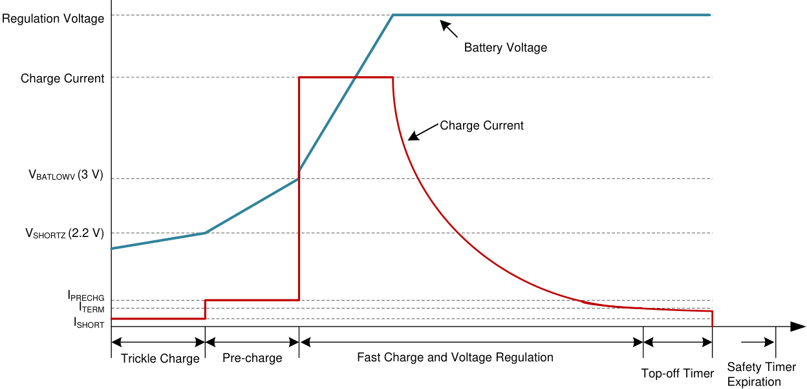

<!-- Start of picture text -->
Regulation Voltage Battery Voltage Charge Current Charge Current VBATLOWV (3 V) VSHORTZ (2.2 V) IPRECHG ITERM ISHORT Trickle Charge Pre-charge Fast Charge and Voltage Regulation Safety Timer Top-off Timer Expiration <!-- End of picture text -->

**Figure 7-3. Battery Charging Profile** 

###### **7.3.6.3 Charging Termination** 

The device terminates a charge cycle when the battery voltage is above the recharge threshold, and the current is below termination current. After the charging cycle has completed, the BATFET turns off. STAT is asserted HIGH to indicate charging is done. The converter keeps running to power the system, and BATFET can turn on again to engage Section 7.3.5.3. 

If the device is in IINDPM/VINDPM regulation, or thermal regulation, the actual charging current will be less than the termination value. In this case, termination is temporarily disabled. 

When termination occurs, the STAT pin goes HIGH. The status register CHRG_STAT is set to 11, and an INT pulse is asserted to the host. Termination can be disabled by writing 0 to the EN_TERM bit prior to charge termination. 

Termination current is set in REG03[3:0]. For a small capacity battery, the termination current can be set as low as 20 mA for full charge. Due to the termination current accuracy, the actual termination current may be higher than the termination target. In order to compensate for termination accuracy, a programmable top-off timer can be applied after termination is detected . The top-off timer will follow safety timer constraints, such that if the safety timer is suspended, so will the top-off timer. Similarly, if the safety timer is doubled, so will the termination top-off timer. The TOPOFF_ACTIVE bit reports whether the top-off timer is active or not. The host can read CHRG_STAT and TOPOFF_ACTIVE to find out the termination status. The STAT pin stays HIGH during a top-off timer counting cycle. 

Top-off timer settings are read in once termination is detected by the charger. Programming a top-off timer value (01, 10, 11) after termination has no effect unless a recharge cycle is initiated. The top-off timer immediately stops if it is disabled (00). An INT is asserted to the host when entering a top-off timer segment as well as when the top-off timer expires. 

###### **7.3.6.4 Thermistor Qualification** 

The device provides a single thermistor input for battery temperature monitoring. 

