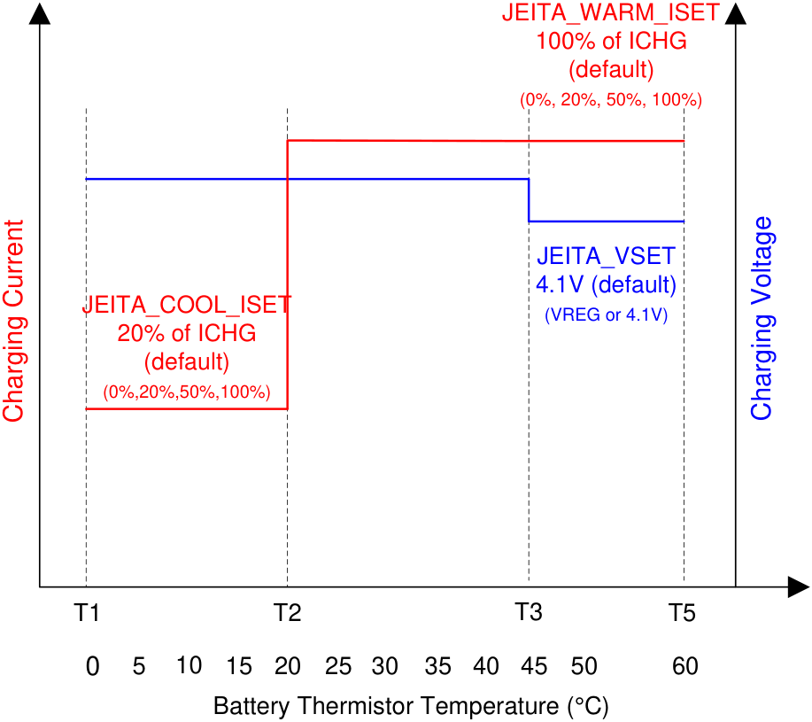

###### **_7.3.6.4.1 JEITA Guideline Compliance During Charging Mode_** 

To improve the safety of charging Li-ion batteries, the JEITA guideline was released on April 20, 2007. The guideline emphasized the importance of avoiding a high charge current and high charge voltage at certain low and high temperature ranges. 

To initiate a charge cycle, the voltage on TS pin, as a percentage of VREGN, must be within the VT1_FALL% to VT5_RISE% thresholds. If the TS voltage percentage exceeds the T1-T5 range, the controller suspends charging, a TS fault is reported and waits until the battery temperature is within the T1-T5 range. 

At cool temperature (T1-T2), the charge current is reduced to a programmable fast charge current (0%, 20% default, 50%, 100% of ICHG, by JEITA_ISET). At warm temperature (T3-T5), the charge voltage is reduced to 4.1 V or kept at VREG (JEITA_VSET), and the charge current can be reduced to a programmable level (0%, 20%, 50%, 100% default). Battery termination is disabled in T3-T5. The charger provides more flexible settings on a T2 and T3 threshold as well to program the temperature profile beyond JEITA. When T1 is set to 0°C and T5 is set to 60°C, T2 can be programmed to 5.5°C/10°C (default)/15°C/20°C, and T3 can be programmed to 40°C/45.5°C (default)/50.5°C/54.5°C. 

When the charger does not need to monitor the NTC, the host sets the TS_IGNORE bit to 1 to ignore the TS pin condition during charging and Boost mode. If the TS_IGNORE bit is set to 1, the TS pin is ignored and the charger ignores the TS pin input. In this case, the NTC_FAULT bits are 000 to report normal TS status. 

<!-- Start of picture text -->
JEITA_WARM_ISET 100% of ICHG (default) (0%, 20%, 50%, 100%) JEITA_VSET 4.1V (default) JEITA_COOL_ISET (VREG or 4.1V) 20% of ICHG (default) (0%,20%,50%,100%) T1 T2 T3 T5 0 5 10 15 20 25 30 35 40 45 50 60 Battery Thermistor Temperature (°C) Charging Current Charging Voltage <!-- End of picture text -->

**Figure 7-4. JEITA Profile** 

Equation 1 through Equation 2 describe how to calculate resistor divider values on the TS pin. 

