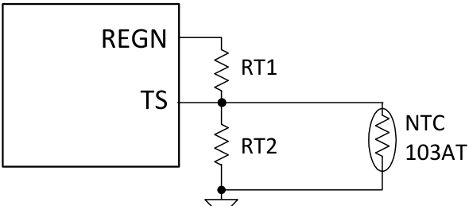
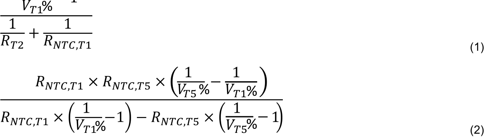

<!-- Start of picture text -->
REGN RT1 TS NTC RT2 103AT <!-- End of picture text -->

**Figure 7-5. TS Pin Resistor Network** 

In the equations above, RNTC, T1 is the NTC thermistor resistance value at temperature T1 and RNTC, T5 is the NTC thermistor resistance value at temperature T5. Selecting a 0°C to 60°C range for a Li-ion or Li-polymer battery then: 

- RNTC,T1 = 27.28 kΩ (0°C) 

- RNTC,T5 = 3.02 kΩ (60°C) 

- RT1 = 5.3 kΩ 

- RT2 = 31.14 kΩ 

###### **_7.3.6.4.2 Boost Mode Thermistor Monitor During Battery Discharge Mode_** 

For battery protection during Boost mode, the device monitors battery temperature to be within the VBCOLD and VBHOT thresholds. When RT1 is 5.3 kΩ and RT2 is 31.14 kΩ, TBCOLD default is -19.5°C and TBHOT default is 64°C. When the temperature is outside of the temperature thresholds, Boost mode is suspended. In addition, the VBUS_STAT bits are set to 000 and NTC_FAULT is reported. Once the temperature returns within the thresholds, Boost mode is recovered and NTC_FAULT is cleared. 

###### **7.3.6.5 Charging Safety Timer** 

The device has a built-in safety timer to prevent an extended charging cycle due to abnormal battery conditions. The safety timer is 2 hours when the battery is below the VBATLOWV threshold and 10 hours (10/20 hours in REG05[2] ) when the battery is higher than the VBATLOWV threshold. When the safety timer expires, the STAT pin is blinking at 1 Hz to report a safety timer expiration fault. 

The user can program the fast charge safety timer through I2 C (CHG_TIMER bit REG05[2]). When the safety timer expires, the fault register CHRG_FAULT bits (REG09[5:4]) are set to 11 and an INT is asserted to the host. The safety timer (both fast charge and precharge) can be disabled through I2 C by setting the EN_TIMER bit. 

During IINDPM/VINDPM regulation, thermal regulation, or JEITA cool/warm when fast charge current is reduced, the safety timer counts at a half clock rate, because the actual charge current is likely below the setting. For example, if the charger is in input current regulation (IINDPM_STAT = 1) throughout the whole charging cycle, and the safety time is set to 10 hours, the safety timer will expire in 20 hours. This half clock rate feature can be disabled by writing 0 to the TMR2X_EN bit. 

