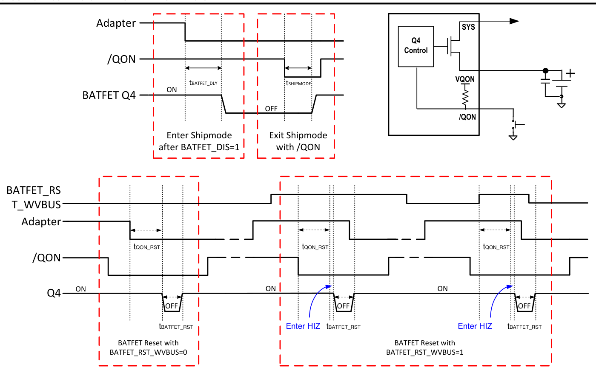

<!-- Start of picture text -->
Adapter SYS Q4 Control /QON tBATFET_DLY tSHIPMODE VQON ON BATFET Q4 OFF /QON Enter Shipmode  Exit Shipmode after BATFET_DIS=1 with /QON BATFET_RS T_WVBUS Adapter tQON_RST tQON_RST tQON_RST /QON Q4  ON ON ON OFF OFF OFF tBATFET_RST Enter HIZ tBATFET_RST Enter HIZ tBATFET_RST BATFET Reset with  BATFET Reset with BATFET_RST_WVBUS=0 BATFET_RST_WVBUS=1 <!-- End of picture text -->

**Figure 7-6. QON Timing** 

###### **_7.3.8 Status Outputs (STAT, INT , PMID_GOOD)_** 

###### **7.3.8.1 Power Good Indicator (PG_STAT Bit)** 

The PG_STAT bit goes to 1 to indicate a good input source when: 

- VVBUS above VVBUS_UVLO 

- VVBUS above battery (not in sleep) 

- VVBUS below VACOV threshold 

- VVBUS above VPOORSRC (typical 3.8 V) when IBADSRC (typical 30 mA) current is applied (not a poor source) 

- Completed Section 7.3.3.3 

###### **7.3.8.2 Charging Status Indicator (STAT)** 

The device indicates the charging state on the open drain STAT pin. The STAT pin can drive an LED. 

**Table 7-4. STAT Pin State** 

###### **7.3.8.3 Interrupt to Host (INT)** 

In some applications, the host does not always monitor charger operation. The INT pulse notifies the host on device operation. The following events generate a 256-μs INT pulse. 

- Good input source detected: 

   - 

   - VVBUS above battery (not in sleep) 

- VVBUS below VACOV threshold

## Structured tables

- [The device indicates the charging state on the open drain STAT pin. The STAT pin can drive an LED. Table 7-4. STAT Pin State](../tables/page-26-the-device-indicates-the-charging-state-on-the-open-drain-stat-pin-the-stat-pin.yaml)
