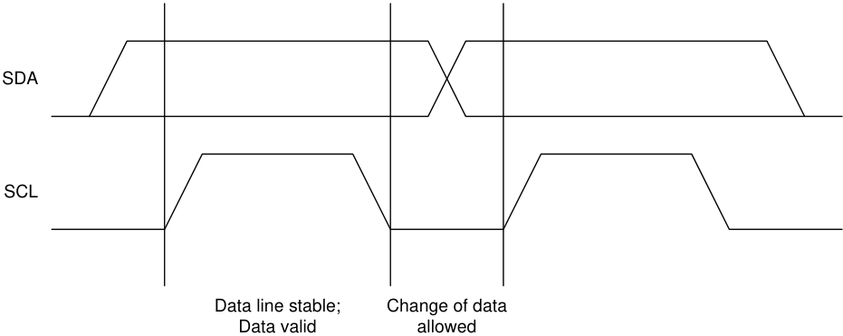
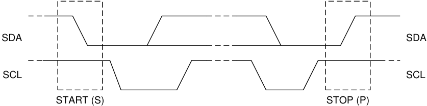

The device operates as a slave device with address 6AH, receiving control inputs from the master device like a microcontroller or a digital signal processor through REG00 to REG0C. A register read beyond REG0C returns 0xFF. The I2 C interface supports both standard mode (up to 100 kbits), and fast mode (up to 400 kbits), connecting to the positive supply voltage via a current source or pullup resistor. When the bus is free, both lines are HIGH. The SDA and SCL pins are open drain. 

###### **7.3.10.1 Data Validity** 

The data on the SDA line must be stable during the HIGH period of the clock. The HIGH or LOW state of the data line can only change when the clock signal on the SCL line is LOW. One clock pulse is generated for each data bit transferred. 

<!-- Start of picture text -->
SDA SCL Data line stable;  Change of data Data valid allowed <!-- End of picture text -->

**Figure 7-7. Bit Transfer on the I****2** **C Bus** 

###### **7.3.10.2 START and STOP Conditions** 

All transactions begin with a START (S) and can be terminated by a STOP (P). A HIGH to LOW transition on the SDA line while SCL is HIGH defines a START condition. A LOW to HIGH transition on the SDA line when the SCL is HIGH defines a STOP condition. START and STOP conditions are always generated by the master. The bus is considered busy after the START condition, and free after the STOP condition. 

<!-- Start of picture text -->
SDA SDA SCL SCL START (S) STOP (P) <!-- End of picture text -->

**Figure 7-8. TS START and STOP conditions** 

###### **7.3.10.3 Byte Format** 

Every byte on the SDA line must be 8 bits long. The number of bytes to be transmitted per transfer is unrestricted. Each byte has to be followed by an Acknowledge bit. Data is transferred with the Most Significant Bit (MSB) first. If a slave cannot receive or transmit another complete byte of data until it has performed some other function, it can hold the clock line SCL low to force the master into a wait state (clock stretching). Data transfer then continues when the slave is ready for another byte of data and release the clock line SCL. 

||||Acknow signal|ledgement from slave||Acknow signal fr|ledgement om receiver||
|---|---|---|---|---|---|---|---|---|
|SDA||MSB|||||||
|SCL|S or Sr|1|2 7|8 9|1|2|8 9|P or Sr|
||START or|||ACK|||ACK|STOP or|
||Repeated|||||||Repeated|
||START|||||||START|

**Figure 7-9. Data Transfer on the I****2** **C Bus** 

