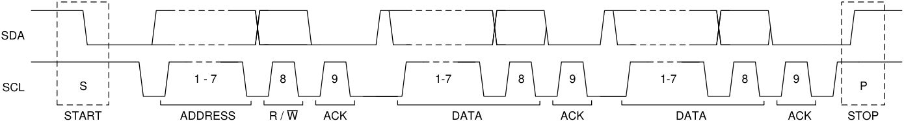
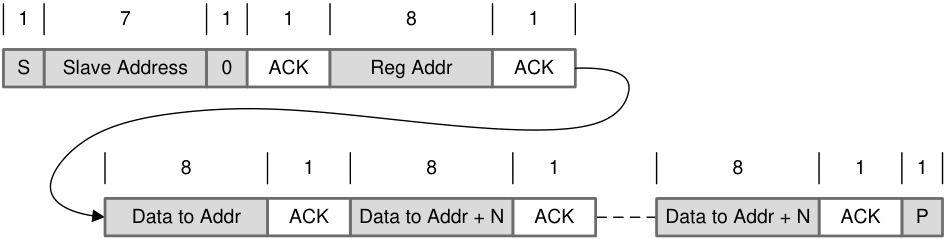

###### **7.3.10.4 Acknowledge (ACK) and Not Acknowledge (NACK)** 

The acknowledge takes place after every byte. The acknowledge bit allows the receiver to signal the transmitter that the byte was successfully received and another byte may be sent. All clock pulses, including the acknowledge ninth clock pulse, are generated by the master. The transmitter releases the SDA line during the acknowledge clock pulse so the receiver can pull the SDA line LOW and it remains stable LOW during the HIGH period of this clock pulse. 

When SDA remains HIGH during the ninth clock pulse, this is the Not Acknowledge signal. The master can then generate either a STOP to abort the transfer or a repeated START to start a new transfer. 

###### **7.3.10.5 Slave Address and Data Direction Bit** 

After the START, a slave address is sent. This address is 7 bits long followed by the eighth bit as a data direction bit (bit R/W). A zero indicates a transmission (WRITE) and a one indicates a request for data (READ). 

<!-- Start of picture text -->
SDA 1 - 7 8 9 1-7 8 9 1-7 8 9 SCL S P START ADDRESS R / W ACK DATA ACK DATA ACK STOP <!-- End of picture text -->

**Figure 7-10. Complete Data Transfer** 

###### **7.3.10.6 Single Read and Write** 

If the register address is not defined, the charger IC sends back NACK and goes back to the idle state. 

|1|7|1 1|8 1 8|1 1||
|---|---|---|---|---|---|
|S|Slave Address|0 ACK|Reg Addr ACK Data to Addr|ACK P||
|1|7 1|**Figu** 1|**re 7-11. Single Write** 8 1 1 7|1 1||
|Sla S|ve Address 0|ACK|Reg Addr ACK S Slave Addr|ACK 1||
||||Data 8|NCK 1|P 1|

**Figure 7-12. Single Read** 

###### **7.3.10.7 Multi-Read and Multi-Write** 

The charger device supports multi-read and multi-write on REG00 through REG0C. 

<!-- Start of picture text -->
1 7 1 1 8 1 S Slave Address 0 ACK Reg Addr ACK 8 1 8 1 8 1 1 Data to Addr ACK Data to Addr + N ACK Data to Addr + N ACK P <!-- End of picture text -->

**Figure 7-13. Multi-Write** 

