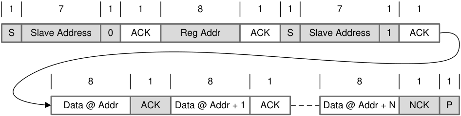
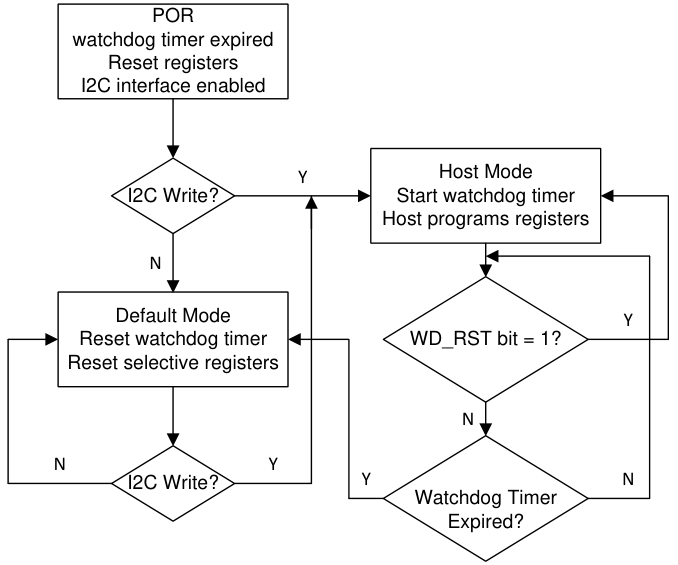

<!-- Start of picture text -->
www.ti.com <!-- End of picture text -->

<!-- Start of picture text -->
1 7 1 1 8 1 1 7 1 1 S Slave Address 0 ACK Reg Addr ACK S Slave Address 1 ACK 8 1 8 1 8 1 1 Data @ Addr ACK Data @ Addr + 1 ACK Data @ Addr + N NCK P <!-- End of picture text -->

**Figure 7-14. Multi-Read** 

REG09[7:0]/REG0A[6:4] are fault/status change registers. They keep all of the fault/status information from the last read until the host issues a new read. For example, if a Charge Safety Timer Expiration fault occurs but recovers later, the fault register REG09 reports the fault when it is read the first time, but returns to normal when it is read the second time. In order to get the fault information at present, the host has to read REG09/REG0A for the second time. 

###### **7.4 Device Functional Modes** 

###### **_7.4.1 Host Mode and Default Mode_** 

The device is a host controlled charger, but it can operate in default mode without host management. In default mode, the device can be used as an autonomous charger with no host or while the host is in sleep mode. When the charger is in default mode, the WATCHDOG_FAULT bit is HIGH. When the charger is in host mode, the WATCHDOG_FAULT bit is LOW. 

After power-on-reset, the device starts in default mode with watchdog timer expired, or default mode. All registers are in the default settings. 

In default mode, the device keeps charging the battery with the 10-hour fast charging safety timer. At the end of the 10-hour, charging is stopped and the buck converter continues to operate to supply system load. Any write command to the device transitions the charger from default mode to host mode. All device parameters can be programmed by the host. To keep the device in host mode, the host has to reset the watchdog timer by writing a 1 to the WD_RST bit before the watchdog timer expires (WATCHDOG_FAULT bit is set), or disable the watchdog timer by setting the WATCHDOG bits = 00. 

All device parameters can be programmed by the host. To keep the device in host mode, the host has to reset the watchdog timer by writing a 1 to the WD_RST bit before the watchdog timer expires (WATCHDOG_FAULT bit is set), or disable the watchdog timer by setting the WATCHDOG bits = 00. 

<!-- Start of picture text -->
POR watchdog timer expired Reset registers I2C interface enabled Y Host Mode I2C Write? Start watchdog timer Host programs registers N Default Mode Y Reset watchdog timer WD_RST bit = 1? Reset selective registers N N Y I2C Write? Y N Watchdog Timer Expired? <!-- End of picture text -->

**Figure 7-15. Watchdog Timer Flow Chart** 

