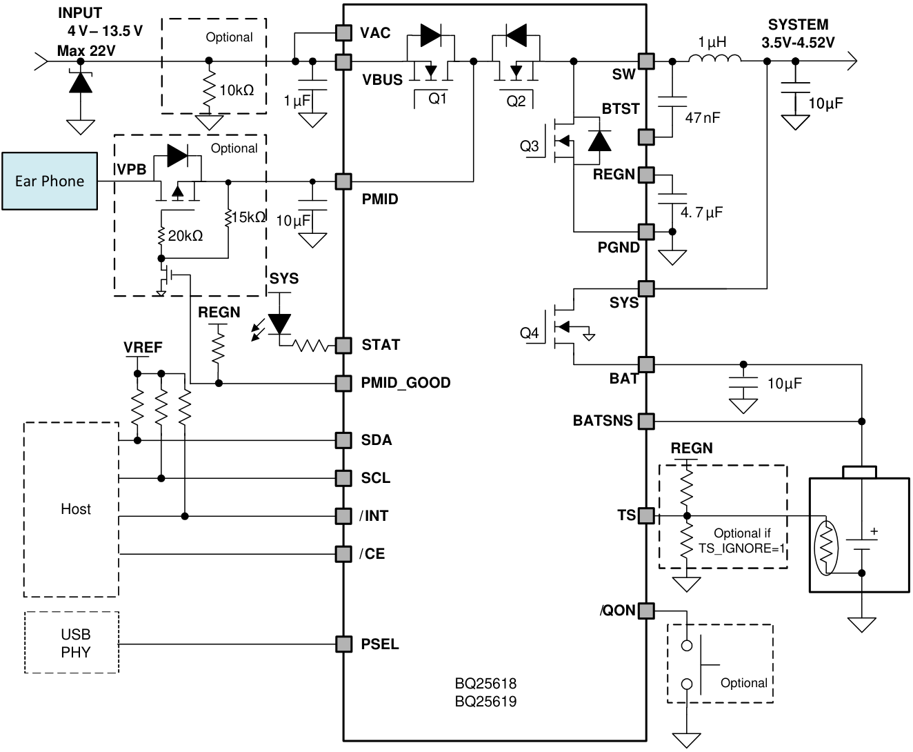

##### **8 Application and Implementation** 

###### **Note** 

Information in the following applications sections is not part of the TI component specification, and TI does not warrant its accuracy or completeness. TI’s customers are responsible for determining suitability of components for their purposes, as well as validating and testing their design implementation to confirm system functionality. 

###### **8.1 Application Information** 

A typical application consists of the device configured as an I2 C controlled power path management device and a single cell battery charger for Li-ion and Li-polymer batteries used in a wide range of smart phones and other portable devices. It integrates an input reverse-block FET (RBFET, Q1), high-side switching FET (HSFET, Q2), low-side switching FET (LSFET, Q3), and battery FET (BATFET Q4) between the system and battery. The device also integrates a bootstrap diode for the high-side gate drive. 

###### **8.2 Typical Application** 

<!-- Start of picture text -->
INPUT 4 V ± 13.5 V Optional VAC 1 µH 3.5V-4.52VSYSTEM Max 22V VBUS SW 10kŸ 1 µF Q1 Q2 BTST 10 µF 47 nF Optional Q3 VPB REGN Ear Phone PMID 15kŸ 10 µF 4. 7 µF 20kŸ PGND SYS SYS REGN Q4 VREF STAT PMID_GOOD BAT 10 µF BATSNS SDA REGN SCL Host /INT TS Optional if  + /CE TS_IGNORE=1 /QON USB PSEL PHY BQ25618 Optional BQ25619 <!-- End of picture text -->

**Figure 8-1. BQ25619 Application Diagram with Optional PMOS** 

