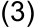
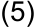

###### **_8.2.1 Design Requirements_** 

For this design example, use the parameters shown in the table below. 

**Table 8-1. Design Parameters** 

###### **_8.2.2 Detailed Design Procedure_** 

###### **8.2.2.1 Inductor Selection** 

The 1.5-MHz switching frequency allows the use of small inductor and capacitor values to maintain an inductor saturation current higher than the charging current (ICHG) plus half the ripple current (IRIPPLE): 

###### ISAT ≥ ICHG + (1/2) IRIPPLE 

The inductor ripple current depends on the input voltage (VVBUS), the duty cycle (D = VBAT/VVBUS), the switching frequency (fS) and the inductance (L). 

The maximum inductor ripple current occurs when the duty cycle (D) is 0.5 or approximately 0.5. Usually inductor ripple is designed in the range between 20% and 40% maximum charging current as a trade-off between inductor size and efficiency for a practical design. 

For compact solution size and efficiency at high current, a 1-µH inductor is recommended. To achieve better light load efficiency during boost mode (output current below 500 mA), the device also supports a 2.2-µH inductor with a 10-µF (min) cap on the system. 

###### **8.2.2.2 Input Capacitor and Resistor** 

Design the input capacitance to provide enough ripple current rating to absorb the input switching ripple current. Worst case RMS ripple current is half of the charging current when the duty cycle is 0.5. If the converter does not operate at 50% duty cycle, then the worst case capacitor RMS current ICIN occurs where the duty cycle is closest to 50% and can be estimated using Equation 5. 

A low ESR ceramic capacitor such as X7R or X5R is preferred for the input decoupling capacitor and should be placed as close as possible to the drain of the high-side MOSFET and source of the low-side MOSFET. The voltage rating of the capacitor must be higher than the normal input voltage level. A 25-V or higher rated capacitor is preferred for a 12-V input voltage. Minimum capacitance of 10 μF is suggested for typical of 1.5-A charging current. 

During high current output over 700 mA in boost mode, a 10-kΩ pull-down resistor on VBUS is recommended to keep VBUS low in case Q1 RBFET leakage gets high. 

###### **8.2.2.3 Output Capacitor** 

Ensure that the output capacitance has enough ripple current rating to absorb the output switching ripple current. Equation 6 shows the output capacitor RMS current ICOUT calculation.

## Structured tables

- [For this design example, use the parameters shown in the table below. Table 8-1. Design Parameters](../tables/page-48-for-this-design-example-use-the-parameters-shown-in-the-table-below-table-8-1-de.yaml)
