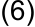
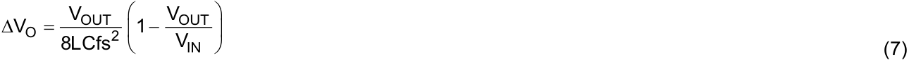
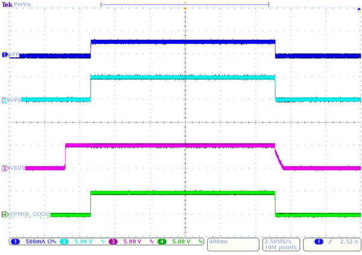
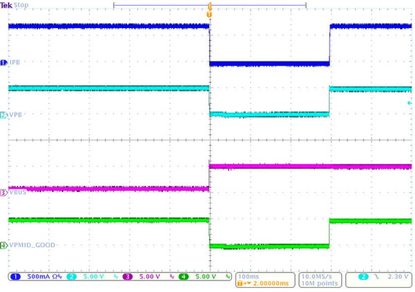
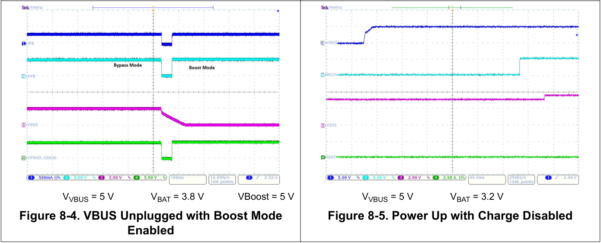

The output capacitor voltage ripple can be calculated as follows: 

At certain input and output voltages and switching frequency, the voltage ripple can be reduced by increasing the output filter LC. 

The charger device has internal loop compensation optimized for >10-μF ceramic output capacitance. The preferred ceramic capacitor is 10-V rating, X7R or X5R. 

###### **_8.2.3 Application Curves_** 

**Figure 8-2. VBUS Plugged In and Unplugged with Boost Mode Disabled** 

**Figure 8-3. VBUS Plugged In with Boost Mode Enabled** 

<!-- Start of picture text -->
VVBUS = 5 V VBAT = 3.8 V VBoost = 5 V VVBUS = 5 V VBAT = 3.2 V Figure 8-4. VBUS Unplugged with Boost Mode  Figure 8-5. Power Up with Charge Disabled Enabled <!-- End of picture text -->

