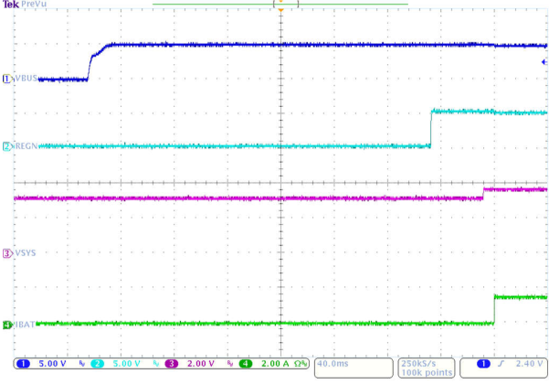
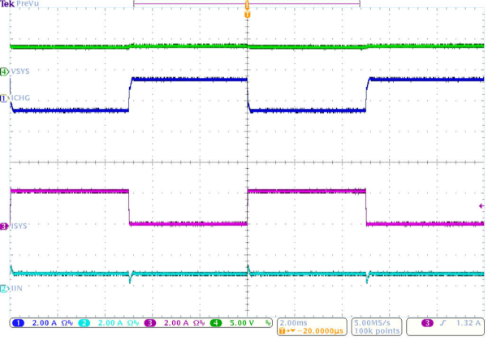
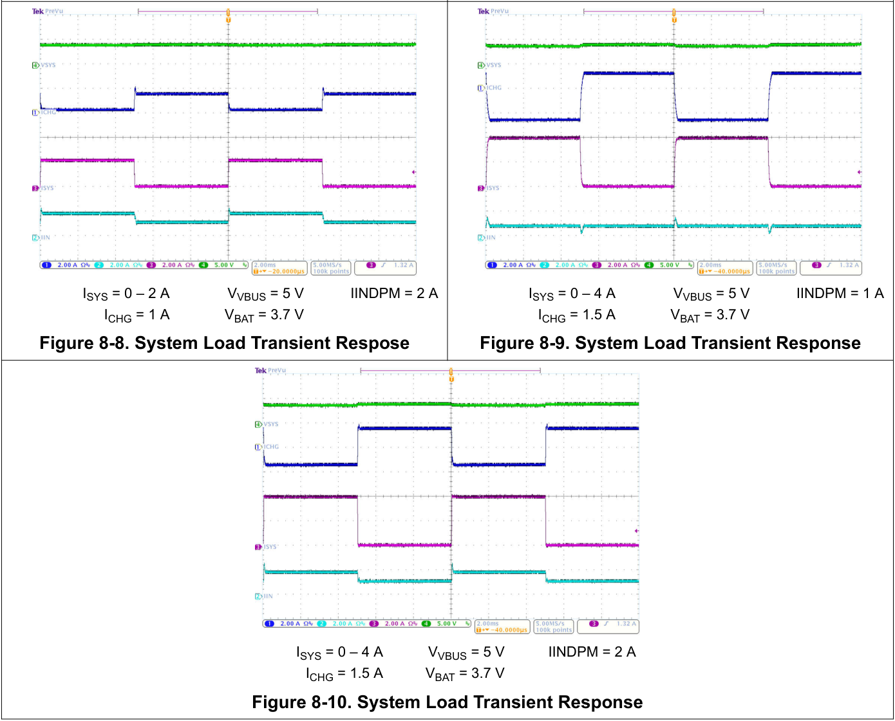

###### **BQ25618, BQ25619** 

###### SLUSDF8F – JUNE 2019 – REVISED FEBRUARY 2025 

**Figure 8-6. Power Up with Charge Enabled** 

**Figure 8-7. System Load Transient Response** 

<!-- Start of picture text -->
ISYS = 0 – 2 A VVBUS = 5 V IINDPM = 2 A ISYS = 0 – 4 A VVBUS = 5 V IINDPM = 1 A ICHG = 1 A VBAT = 3.7 V ICHG = 1.5 A VBAT = 3.7 V Figure 8-8. System Load Transient Respose Figure 8-9. System Load Transient Response ISYS = 0 – 4 A VVBUS = 5 V IINDPM = 2 A ICHG = 1.5 A VBAT = 3.7 V Figure 8-10. System Load Transient Response <!-- End of picture text -->

