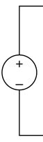
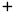

##### **10 Layout** 

###### **10.1 Layout Guidelines** 

The switching node rise and fall times should be minimized for minimum switching loss. Proper layout of the components to minimize the high frequency current path loop (see Figure 10-1) is important to prevent electrical and magnetic field radiation and high frequency resonant problems. Follow this specific order carefully to achieve the proper layout. 

1. Place an input capacitor as close as possible to the PMID pin and GND pin connections and use the shortest copper trace connection or GND plane. Add a 1-nF small size (such as 0402 or 0201) decoupling cap for the high frequency noise filter and EMI improvement. 

2. Place the inductor input pin as close as possible to SW pin. Minimize the copper area of this trace to lower electrical and magnetic field radiation but make the trace wide enough to carry the charging current. Do not use multiple layers in parallel for this connection. Minimize parasitic capacitance from this area to any other trace or plane. 

3. Put the output capacitor near to the inductor and the device. Ground connections need to be tied to the IC ground with a short copper trace connection or GND plane. 

4. Route the analog ground separately from power ground. Connect the analog ground and connect power ground separately. Connect the analog ground and power ground together using the thermal pad as the single ground connection point. Or use a 0-Ω resistor to tie the analog ground to power ground. 

5. Use a single ground connection to tie the charger power ground to the charger analog ground just beneath the device. Use ground copper pour but avoid power pins to reduce inductive and capacitive noise coupling. 

6. Place the decoupling capacitors next to the IC pins and make the trace connection as short as possible. 7. It is critical that the exposed thermal pad on the backside of the device package be soldered to the PCB ground. Ensure that there are sufficient thermal vias directly under the IC, connecting to the ground plane on the other layers. 

8. Ensure that the number and sizes of vias allow enough copper for a given current path. 

See the _BQ25618 BMS024 Evaluation Module User's Guide_ and _BQ25619 BMS025 Evaluation Module EVM User's Guide_ for the recommended component placement with trace and via locations. For the VQFN information, refer to _Quad Flatpack No-Lead Logic Packages Application Report_ and _QFN and SON PCB Attachment Application Report_ . 

###### **10.2 Layout Example** 

<!-- Start of picture text -->
+ ± <!-- End of picture text -->

<!-- Start of picture text -->
+ <!-- End of picture text -->

**Figure 10-1. High Frequency Current Path** 

