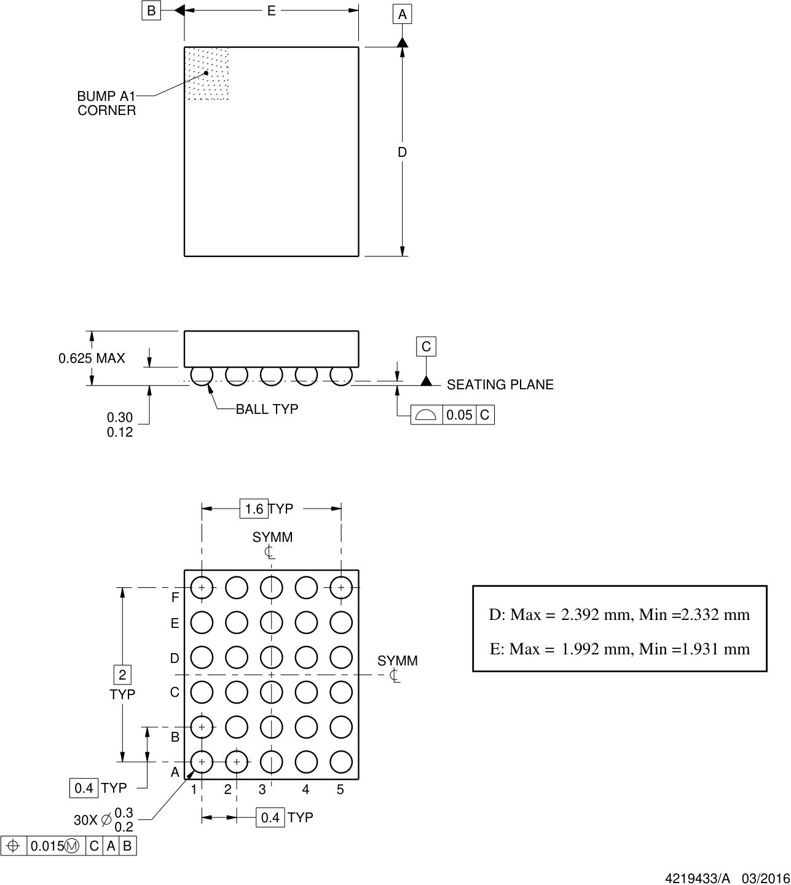

## **PACKAGE OUTLINE** 

DIE SIZE BALL GRID ARRAY 

<!-- Start of picture text -->
B E A BUMP A1 CORNER D C 0.625 MAX SEATING PLANE B ALL TYP 0.30 0.05 C 0.12 1.6 TYP SYMM F D: Max = 2.392 mm, Min = 2.332 mm E E: Max =  1.992 mm, Min = 1.931 mm D SYMM 2 TYP C B A 0.4  TYP 1 2 3 4 5 30X  0.3 0.4  TYP 0.2 0.015 C A B 4219433/A   03/2016 <!-- End of picture text -->

NOTES: 

1. All linear dimensions are in millimeters. Any dimensions in parenthesis are for reference only. Dimensioning and tolerancing per ASME Y14.5M. 

2. This drawing is subject to change without notice. 

