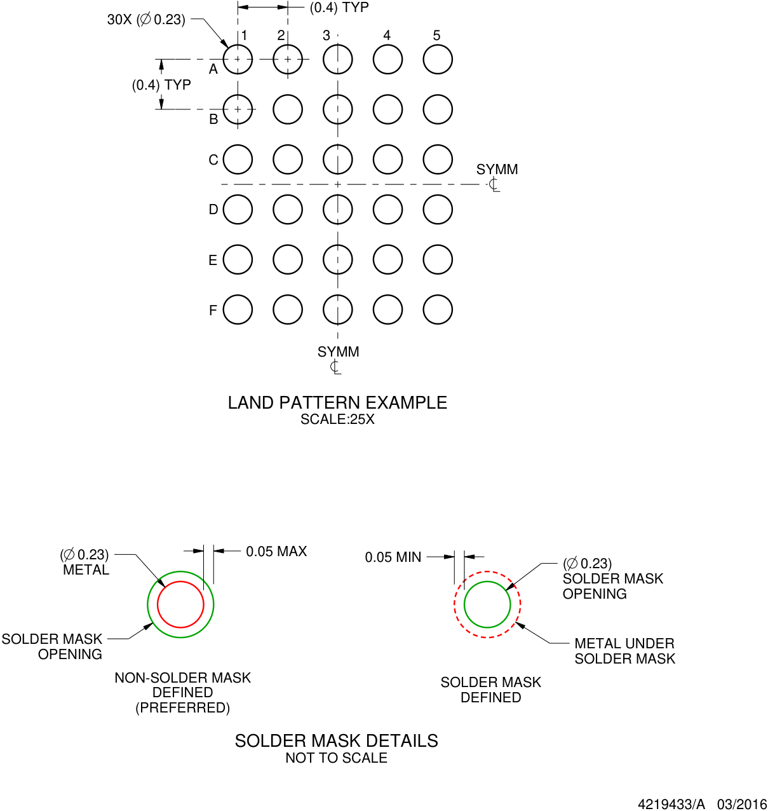

## **EXAMPLE BOARD LAYOUT** 

# **YFF0030** 

DIE SIZE BALL GRID ARRAY 

<!-- Start of picture text -->
(0.4) TYP 30X ( 0.23) 1 2 3 4 5 A (0.4) TYP B C SYMM D E F SYMM LAND PATTERN EXAMPLE SCALE:25X ( 0.23) 0.05 MAX 0.05 MIN METAL ( 0.23) SOLDER MASK OPENING SOLDER MASK METAL UNDER OPENING SOLDER MASK NON-SOLDER MASK SOLDER MASK DEFINED DEFINED (PREFERRED) SOLDER MASK DETAILS NOT TO SCALE 4219433/A   03/2016 <!-- End of picture text -->

NOTES: (continued) 

3. Final dimensions may vary due to manufacturing tolerance considerations and also routing constraints. For more information, see Texas Instruments literature number SNVA009 (www.ti.com/lit/snva009). 

