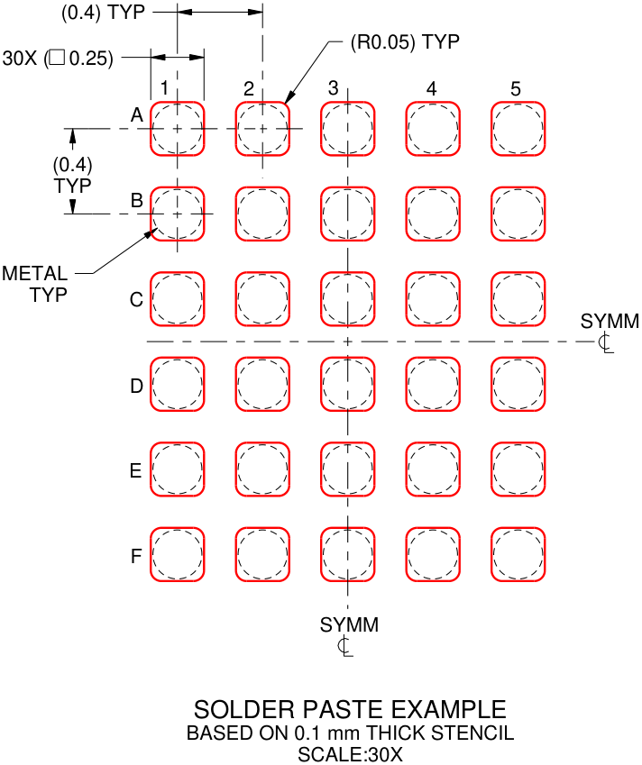

## **EXAMPLE STENCIL DESIGN** 

# **YFF0030** 

#### **DSBGA - 0.625 mm max height** 

DIE SIZE BALL GRID ARRAY 

<!-- Start of picture text -->
(0.4) TYP (R0.05) TYP 30X ( 0.25) 1 2 3 4 5 A (0.4) TYP B METAL TYP C SYMM D E F SYMM SOLDER PASTE EXAMPLE BASED ON 0.1 mm THICK STENCIL SCALE:30X <!-- End of picture text -->

NOTES: (continued) 

4. Laser cutting apertures with trapezoidal walls and rounded corners may offer better paste release. 

