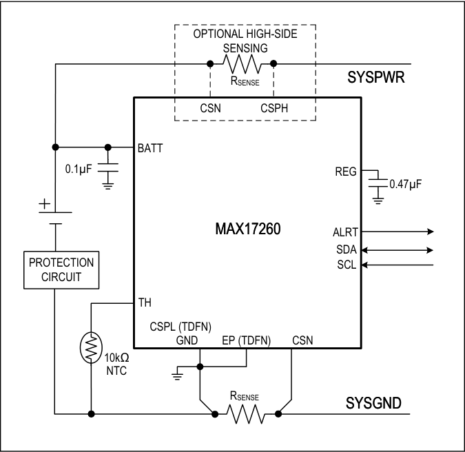

# **MAX17260** 

# **5.1μA 1-Cell Fuel Gauge with ModelGauge m5 EZ and Optional High-Side Current Sensing** 

## **General Description** 

The MAX17260 is an ultra-low power fuel gauge IC which implements the Maxim ModelGauge™ m5 algorithm. The IC monitors a single-cell battery pack and supports both high-side and low-side current sensing. 

The ModelGauge m5 EZ algorithm makes fuel gauge implementation easy by eliminating battery characterization requirements and simplifying host software interaction. The algorithm provides tolerance against battery diversity for most lithium batteries and applications. The algorithm combines the short-term accuracy and linearity of a coulomb counter with the long-term stability of a voltagebased fuel gauge, along with temperature compensation to provide industry-leading fuel gauge accuracy. The IC automatically compensates for cell-aging, temperature, discharge rate, and provides accurate state-of-charge (SOC) in percentage (%) and remaining capacity in milliampere-hours (mAh) over a wide range of operating conditions. As the battery approaches the critical region near empty, the algorithm invokes a special correction mechanism that eliminates any error. The IC provides accurate estimation of time-to-empty and time-to-full and provides three methods for reporting the age of the battery: reduction in capacity, increase in battery resistance, and cycle odometer. 

The IC provides precision measurements of current, voltage, and temperature. The temperature of the battery pack is measured using an internal temperature sensor or external thermistor. A 2-wire I2 C interface provides access to data and control registers. The IC is available in tiny lead-free 0.4mm pitch, 1.5mm x 1.5mm, 9-pin WLP package and 3mm x 3mm, 14-pin TDFN package. 

## **Applications** 

- Wearables, Smartwatches 

- Tablets, 2-in-1 Laptops 

- Bluetooth Headsets 

- Health and Fitness Monitors 

- Digital Still, Video, and Action Cameras 

- Medical Devices 

- Handheld Computers and Terminals 

- Wireless Speakers 

- Home and Building Automation, Sensors 

- Portable Game Players 

- Toys 

## **Benefits and Features** 

- ModelGauge m5 EZ 

   - No Characterization Required for EZ Performance 

   - Robust Against Battery Variation 

   - Eliminates Error Near Empty Voltage 

   - Eliminates Coulomb-Counter Drift 

   - Compensates for Age, Current, and Temperature 

   - Does Not Require Empty, Full, or Idle States 

- Low 5.1μA Operating Current 

- Accurate Current Sensing 

   - High-Side or Low-Side Sensing Option 

- Wide Sense Resistor Range: 1mΩ to 1000mΩ 

- Trace Sensing with Temperature Compensation 

- Supports Li+ and Variants Including LiFePO4 

- Thermistor or ±1°C Internal Temperature 

- Dynamic Power Estimates Power Capability During Discharge 

- Time-to-Empty and Time-to-Full Estimation 

- Predicts Remaining Capacity Under Theoretical Load 

- No Calibration Required 

- Alert Indicator for Voltage, SOC, Temperature, Current, and 1% SOC Change 

## **Simple Fuel-Gauge Circuit Diagram** 

<!-- Start of picture text -->
OPTIONAL HIGH-SIDE SENSING RSENSE SYSPWR CSN CSPH BATT 0.1µF REG 0.47µF MAX17260 ALRT SDA PROTECTION  SCL CIRCUIT TH CSPL (TDFN) GND EP (TDFN) CSN 10kΩ NTC RSENSE SYSGND <!-- End of picture text -->

_ModelGauge is a trademark of Maxim Integrated Products, Inc._ 

##### **_<u>Ordering Information</u> appears at end of data sheet._** 

