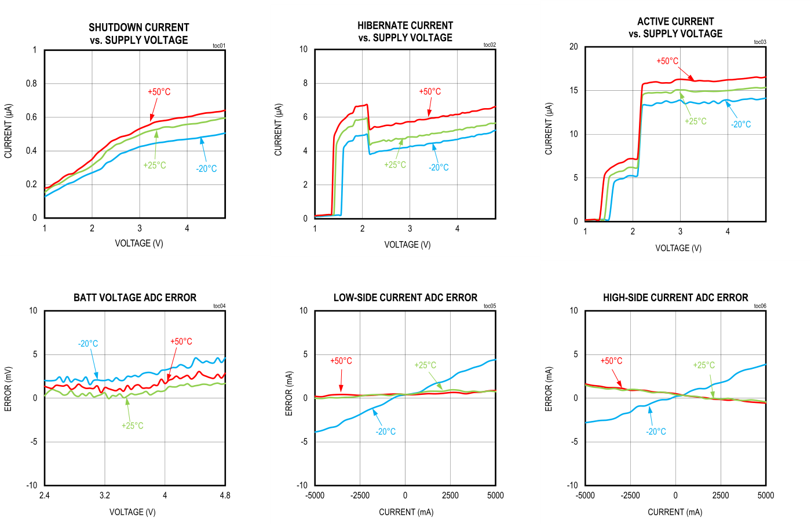

# MAX17260 

# 5.1μA 1-Cell Fuel Gauge with ModelGauge m5 EZ and Optional High-Side Current Sensing 

- **Note 2:** Timing must be fast enough to prevent the IC from entering shutdown mode due to bus low for a period greater than the shutdown timer setting. 

- **Note 3:** fSCL must meet the minimum clock low time plus the rise/fall times. 

- **Note 4:** The maximum tHD:DAT has only to be met if the device does not stretch the low period (tLOW) of the SCL signal. 

- **Note 5:** This device internally provides a hold time of at least 100ns for the SDA signal (refer to the minimum VIH of the SCL signal) to bridge the undefined region of the falling edge of SCL. 

- **Note 6:** Filters on SDA and SCL suppress noise spikes at the input buffers and delay the sampling instant. 

- **Note 7:** CB represents total capacitance of one bus line in pF. 

## **Typical Operating Characteristics** 

(TA = +25°C, unless otherwise noted.) 

