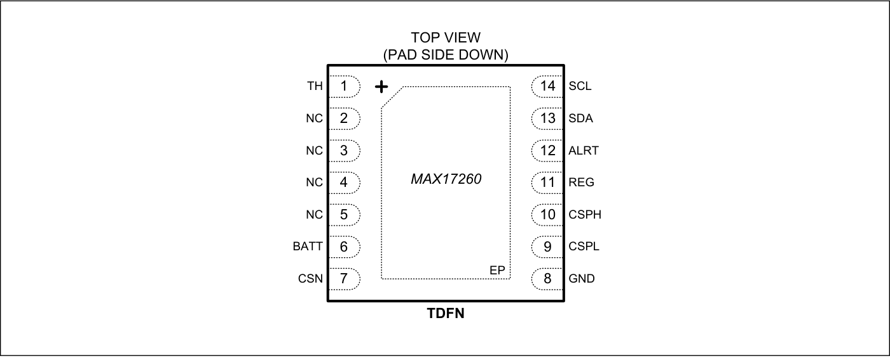

# MAX17260 

# 5.1μA 1-Cell Fuel Gauge with ModelGauge m5 EZ and Optional High-Side Current Sensing 

## **Pin Configuration(s)** 

### **TDFN** 

<!-- Start of picture text -->
TOP VIEW (PAD SIDE DOWN) TH 1 14 SCL NC 2 13 SDA NC 3 12 ALRT NC 4 MAX17260 11 REG NC 5 10 CSPH BATT 6 9 CSPL EP CSN 7 8 GND TDFN <!-- End of picture text -->

### **WLP** 

<!-- Start of picture text -->
TOP VIEW (BUMP SIDE DOWN) MAX17260 TH SCL CSN A1 A2 A3 BATT ALRT REG B1 B2 B3 SDA CSPH GND/CSPL C1 C2 C3 WLP <!-- End of picture text -->

