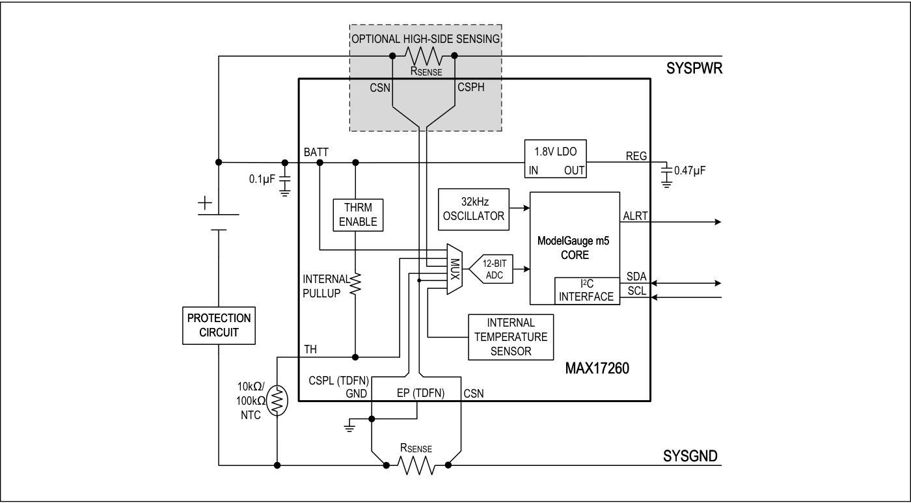

# MAX17260 

# 5.1μA 1-Cell Fuel Gauge with ModelGauge m5 EZ and Optional High-Side Current Sensing 

## **Functional Diagram** 

<!-- Start of picture text -->
OPTIONAL HIGH-SIDE SENSING RSENSE SYSPWR CSN CSPH BATT 1.8V LDO REG IN OUT 0.47µF 0.1µF 32kHz THRM OSCILLATOR ALRT ENABLE ModelGauge m5 CORE 12-BIT INTERNAL  ADC I 2 C  SDA PULLUP INTERFACE SCL PROTECTION  INTERNAL CIRCUIT TEMPERATURE TH SENSOR MAX17260 10kΩ/ CSPL (TDFN) 100kΩ GND EP (TDFN) CSN NTC RSENSE SYSGND MUX <!-- End of picture text -->

## **Detailed Description** 

The MAX17260 is an ultra-low power fuel gauge IC which implements the Maxim ModelGauge m5 EZ algorithm. The IC measures voltage, current, and temperature accurately to produce fuel gauge results. The ModelGauge m5 EZ robust algorithm provides tolerance against battery diversity. This additional robustness enables simpler implementation for most applications and batteries by avoiding time-consuming battery characterization. 

The ModelGauge m5 algorithm combines the short-term accuracy and linearity of a coulomb-counter with the long-term stability of a voltage-based fuel gauge, along with temperature compensation to provide industry-leading fuel gauge accuracy. The IC automatically compensates for aging, temperature, and discharge rate and provides accurate state of charge (SOC) in percentage (%) and remaining capacity in milliampere-hours (mAhr) over a wide range of operating conditions. Fuel gauge error always converges to 0% as the cell approaches empty. 

The IC has a register set that is compatible with Intel's DBPT v2 dynamic power standard. This allows the system designer to safely estimate the maximum allowed CPU turbo-boost power level in complex power conditions. The IC provides accurate estimation of time-to-empty and time-to-full and provides three methods for reporting the age of the battery: reduction in capacity, increase in battery resistance, and cycle odometer. 

The IC contains a unique serial number. It can be used for cloud-based authentication. See the _<u>Serial Number Feature</u>_ section for more information. 

Communication to the host occurs over standard I2 C interface. The I2 C slave address for the MAX17260 is specified in the Ordering Information table. For information about I2 C communication, refer to the _<u>User Guide 6597: MAX1726x ModelGauge m5 EZ User Guide</u>_ <u>.</u> 

