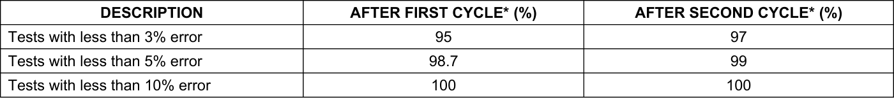
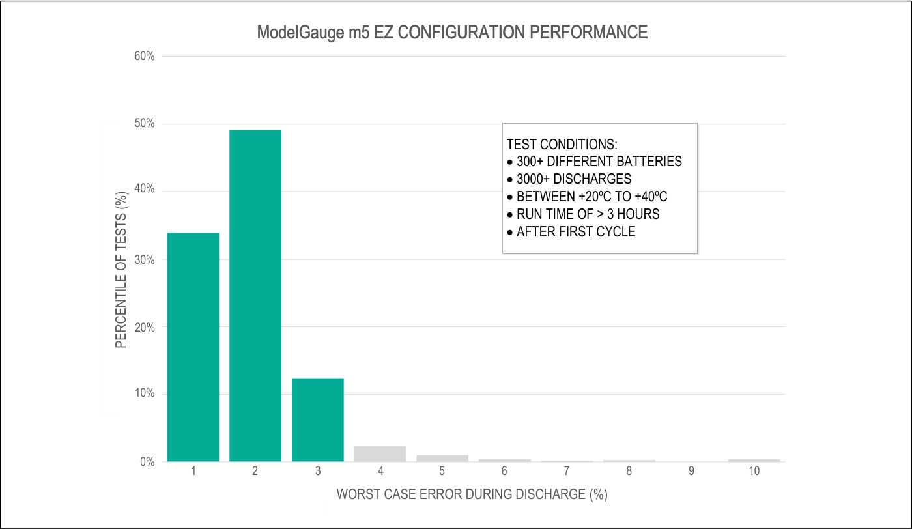

# MAX17260 

# 5.1μA 1-Cell Fuel Gauge with ModelGauge m5 EZ and Optional High-Side Current Sensing 

### **ModelGauge m5 EZ Performance** 

ModelGauge m5 EZ performance provides plug-and-play operation when the IC is connected to most lithium batteries. While the IC can be custom tuned to the application's specific battery through a characterization process for ideal performance, the IC has the ability to provide good performance for most applications with no custom characterization required. <u>Table 1</u> and <u>Figure 1</u> show the performance of the ModelGauge m5 algorithm in applications using ModelGauge m5 EZ configuration. 

The ModelGauge m5 EZ provides good performance for most cell types. For some chemistries, such as lithium-ironphosphate (LiFePO4) and Panasonic NCR/NCA series cells, it is suggested that the customer request a custom model from Analog Devices for best performance. 

For even better fuel-gauging accuracy than ModelGauge m5 EZ, contact Analog Devices for information regarding cell characterization. 

## **Table 1. ModelGauge m5 EZ Performance** 

<!-- Start of picture text -->
DESCRIPTION  AFTER FIRST CYCLE* (%)  AFTER SECOND CYCLE* (%) Tests with less than 3% error  95  97 Tests with less than 5% error  98.7  99 Tests with less than 10% error  100  100 <!-- End of picture text -->

* _Test conditions: +20°C and +40°C, run time of > 3 hours._ 

<!-- Start of picture text -->
ModelGauge m5 EZ CONFIGURATION PERFORMANCE 60% 50% TEST CONDITIONS: · 300+ DIFFERENT BATTERIES · 3000+ DISCHARGES 40% · BETWEEN +20ºC TO +40ºC · RUN TIME OF > 3 HOURS · AFTER FIRST CYCLE 30% 20% 10% 0% 1 2 3 4 5 6 7 8 9 10 WORST CASE ERROR DURING DISCHARGE (%) PERCENTILE OF TESTS (%) <!-- End of picture text -->

_Figure 1. ModelGauge m5 EZ Configuration Performance_

## Structured tables

- [characterization. Table 1. ModelGauge m5 EZ Performance](../tables/page-14-characterization-table-1-modelgauge-m5-ez-performance.yaml)
