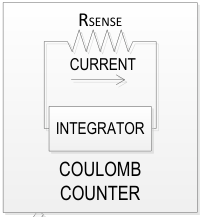
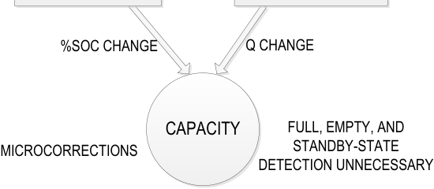

# MAX17260 

# 5.1μA 1-Cell Fuel Gauge with ModelGauge m5 EZ and Optional High-Side Current Sensing 

<!-- Start of picture text -->
RSENSE CURRENT INTEGRATOR COULOMB COUNTER <!-- End of picture text -->

<!-- Start of picture text -->
ModelGauge ALGORITHM <!-- End of picture text -->

<!-- Start of picture text -->
%SOC CHANGE Q CHANGE CAPACITY FULL, EMPTY, AND MICROCORRECTIONS STANDBY-STATE DETECTION UNNECESSARY <!-- End of picture text -->

_Figure 2. ModelGauge m5 Algorithm_ 

The ModelGauge m5 algorithm uses this battery state information and accounts for temperature, battery current, age, and application parameters to determine the remaining capacity available to the system. As the battery approaches the critical region near empty, the ModelGauge m5 algorithm invokes a special error correction mechanism that eliminates any error. 

The ModelGauge m5 algorithm continually adapts to the cell and application through independent learning routines. As the cell ages, its change in capacity is monitored and updated and the voltage-fuel-gauge dynamics adapt based on cellvoltage behavior in the application. 

### **ModelGauge m5 Algorithm Output Registers** 

The following registers are outputs from the ModelGauge m5 algorithm. The values in these registers become valid 351ms after the IC is configured. 

#### **RepCap Register (05h)** 

Register Type: Capacity 

RepCap or reported remaining capacity in mAh. The ModelGauge m5 algorithm prevents remaining capacity from making a sudden jump during load change conditions. 

#### **RepSOC Register (06h)** 

Register Type: Percentage 

RepSOC is the reported state-of-charge percentage output for use by the application user interface. 

#### **FullCapRep Register (10h)** 

Register Type: Capacity 

This register reports the full capacity that goes with RepCap, generally used for reporting to the user. A new full-capacity value is calculated at the end of every charge cycle in the application. 

#### **TTE Register (11h)** 

Register Type: Time 

The TTE register holds the estimated time to empty for the application under present temperature and load conditions. TTE register is only valid when current register is negative. 

#### **TTF Register (20h)** 

Register Type: Time 

