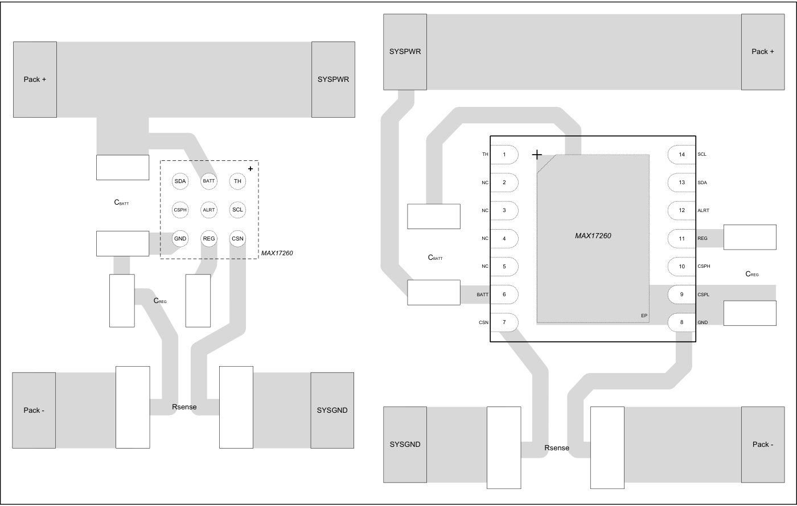

# MAX17260 

# 5.1μA 1-Cell Fuel Gauge with ModelGauge m5 EZ and Optional High-Side Current Sensing 

### **Layout Guidelines** 

Proper circuit layouts for low-side current measurement as shown in <u>Figure 3</u> or high-side current measurement as shown in Figure 4 is essential for voltage, temperature, and current-measurement accuracy. The recommended layout guidelines are as follows: 

- CSN and GND traces should make Kelvin connections to the sense resistor. Current is measured differentially through the CSN and GND pins. Any shared high current paths on these traces affect current measurement accuracy. 

- For TDFN package designs, connect EP directly to the GND pin. 

- REG capacitor trace loop area should be minimized. REG should be connected to the GND pin as close as possible to the IC. Run only a single GND trace to the sense resistor. This helps filter any noise from the internal regulated supply. 

- All other ground connections should be kept separate from the current sensing traces. 

   - The Kelvin lines should not be shared with other circuits. 

   - Vias on the Kelvin traces are not recommended. 

- There are no limitations on any other IC connection. Other IC pins, as well as any external components mounted to these pins, have no special layout requirements. 

<!-- Start of picture text -->
SYSPWR Pack + Pack + SYSPWR TH 1 14 SCL SDA BATT TH NC 2 13 SDA CBATT CSPH ALRT SCL NC 3 12 ALRT GND REG CSN NC 4 MAX17260 11 REG MAX17260 CBATT NC 5 10 CSPH CREG BATT 6 9 CSPL CREG EP CSN 7 8 GND Pack - Rsense SYSGND SYSGND Rsense Pack - <!-- End of picture text -->

_Figure 3. MAX17260 Low-Side Current Measurement Layout Guide_ 

