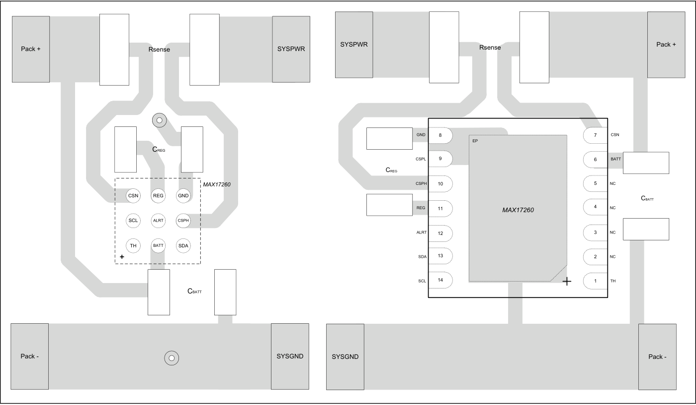

# MAX17260 

# 5.1μA 1-Cell Fuel Gauge with ModelGauge m5 EZ and Optional High-Side Current Sensing 

<!-- Start of picture text -->
Pack + Rsense SYSPWR SYSPWR Rsense Pack + GND 8 7 CSN EP CREG CSPL 9 6 BATT CREG MAX17260 CSPH 1 0 5 NC CS N REG GND CBATT REG 11 MAX17260 4 NC SCL ALRT CSPH ALRT 12 3 NC TH BATT SDA SDA 13 2 NC SCL 14 1 TH CBATT Pack - SYSGND SYSGND Pack - <!-- End of picture text -->

_Figure 4. MAX17260 High-Side Current Measurement Layout Guide_ 

