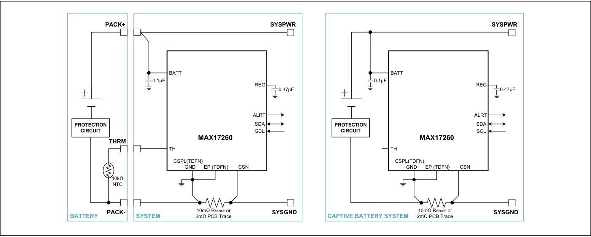
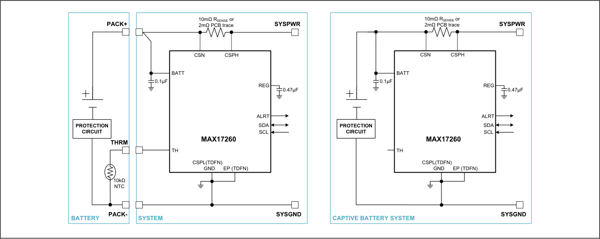

# MAX17260 

# 5.1μA 1-Cell Fuel Gauge with ModelGauge m5 EZ and Optional High-Side Current Sensing 

## **Typical Application Circuits** 

<u>Figure 5</u> shows a typical operating circuit for low-side current sensing. A sense resistor is typically used. Alternatively, a PCB trace can be used for high-current or small-form-factor applications. For better measurement, place the sensing element as close as possible to the CSN and GND pins. The IC automatically compensates for the effect of environmental temperature and trace heating on trace resistance. 

<u>Figure 6</u> shows the typical application circuit for high-side current measurement. In this configuration, tie the CSN pin to the battery pack positive terminal. Connect a desired sense resistor or PCB trace across CSN and CSPH. 

<!-- Start of picture text -->
PACK+ SYSPWR SYSPWR BATT BATT 0.1µF REG 0.1µF REG 0.47µF 0.47µF ALRT ALRT PROTECTION  SDA PROTECTION  SDA CIRCUIT SCL CIRCUIT SCL THRM MAX17260 MAX17260 TH TH CSPL(TDFN) CSPL(TDFN) GND EP (TDFN) CSN GND EP (TDFN) CSN 10kΩ NTC PACK- 10mΩ RSENSE or  SYSGND 10mΩ RSENSE or  SYSGND BATTERY SYSTEM 2mΩ PCB Trace CAPTIVE BATTERY SYSTEM 2mΩ PCB Trace <!-- End of picture text -->

_Figure 5. Low-Side Current Measurement Typical Applications Circuit_ 

<!-- Start of picture text -->
PACK+ 10mΩ R2mΩ PCB traceSENSE or  SYSPWR 10mΩ R2mΩ PCB traceSENSE or  SYSPWR CSN CSPH CSN CSPH BATT BATT 0.1µF REG 0.1µF REG 0.47µF 0.47µF ALRT ALRT PROTECTION  SDA PROTECTION  SDA CIRCUIT SCL CIRCUIT SCL THRM MAX17260 MAX17260 TH TH CSPL(TDFN) CSPL(TDFN) GND EP (TDFN) GND EP (TDFN) 10kΩ NTC PACK- SYSGND SYSGND BATTERY SYSTEM CAPTIVE BATTERY SYSTEM <!-- End of picture text -->

_Figure 6. High-Side Current Measurement Typical Applications Circuit_ 

