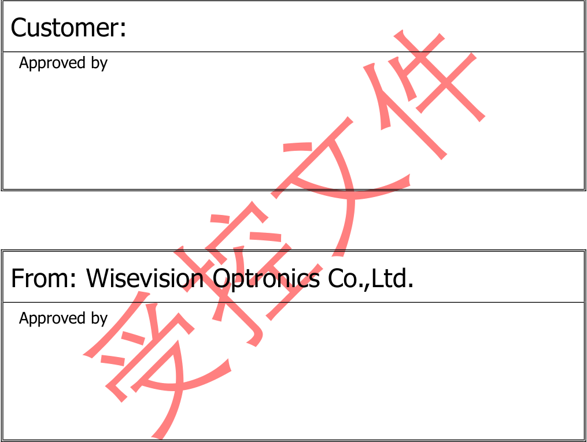

# **Product Specification** 

Part Name: OEL Display Module Customer Part ID: Wisevision Part ID:  X096-2864KSWPG01-H30 Ver:  A 

<!-- Start of picture text -->
Customer:  Approved by From: Wisevision Optronics Co.,Ltd.  Approved by <!-- End of picture text -->

## Wisevision Optronics Co.,Ltd. 

Notes: 

1. Please contact Wisevision Optronics Co.,Ltd. before assigning your product based on this module specification 

2. The information contained herein is presented merely to indicate the characteristics and performance of our products.  No responsibility is assumed by Wisevision Optronics Co.,Ltd. for any intellectual property claims or other problems that may result from application based on the module described herein. 

