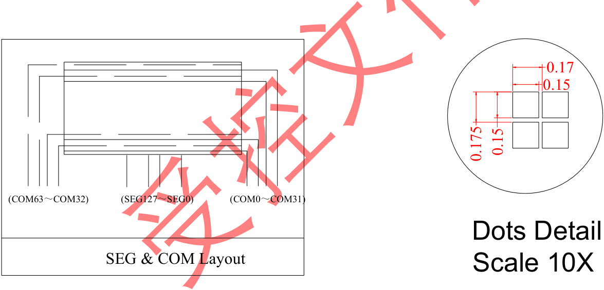

### **1. Basic Specifications** 

#### **1.1 Display Specifications** 

- 1) Display Mode: Passive Matrix 2) Display Color: Monochrome (White) 3) Drive Duty: 1/64 Duty 

#### **1.2 Mechanical Specifications** 

- 1) Outline Drawing: According to the annexed outline drawing 

- 2) Number of Pixels: 128  64 3) Panel Size: 24.7  16.6  1.3 (mm) 4) Active Area: 21.74  11.175 (mm) 

- 5) Pixel Pitch: 0.17  0.175 (mm) 

- 6) Pixel Size: 0.15  0.15 (mm) 7) Weight: TBD 

#### **1.3 Active Area / Memory Mapping & Pixel Construction** 

<!-- Start of picture text -->
0.17 0.15 (COM63 ～ COM32) (SEG127 ～ SEG0) (COM0 ～ COM31) Dots Detail SEG & COM Layout Scale 10X 0.175 0.15 <!-- End of picture text -->

