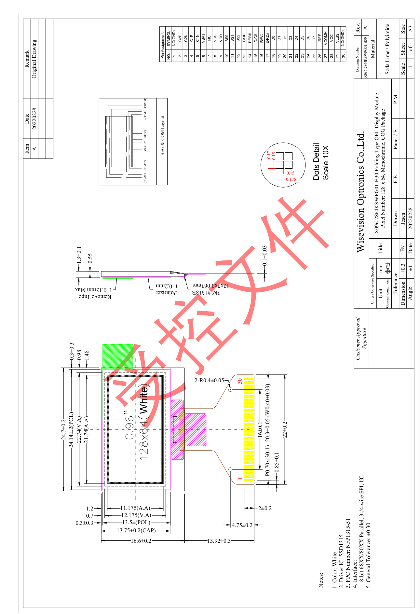

#### **1.4 Mechanical Drawing** 

<!-- Start of picture text -->
0.15 0.175 2-R0.4±0.05 1.2 1 1.175(A.A) 2±0.2 0.7 1 2.175(V.A) 0.3±0.3 1 3.5±(POL) 4.75±0.2 1 3.75±0.2(CAP) 1 6.6±0.2 1 3.92±0.3 Rev. A Size A3 NC(GND) C2P C2N C1P C1N VBAT NC VSS VDD BS0 BS1 BS2 CS# RES# D/C# R/W# E/RD# D0 D1 D2 D3 D4 D5 D6 D7 IREF VCOMH VCC VLSS NC(GND) 1 2 3 4 5 6 7 8 9 10 11 12 13 14 15 16 17 18 19 20 21 22 23 24 25 26 27 28 29 30 Material Sheet 1 of 1 Remark Drawing Number Soda Lime / Polyimide Scale 1:1 Original Drawing X096-2864KSWPG01-H30 P.M. COM31) ～ (COM0 Date 20220228 SEG0) ～ A (SEG127 Panel / E. Item SEG & COM Layout 0.17 0.15 COM32) ～ (COM63 Dots Detail Scale 10X  64, Monochrome, COG Package x E.E. Drawn Jesen 20220228 X096-2864KSWPG01-H30 Folding Type OEL Display Module     Pixel Number: 128 Wisevision Optronics Co.,Ltd. Title By Date 1.3±0.1 0.55 0.1±0.03 mm ±0.3 ±1 Tolerance Unit Angle Unless Otherwise Specified General Roughness Dimension Signature 0.3±0.3 0.98 1.48 Customer Approval 30 White 24.7±0.2 16±0.1 22±0.2 22.74(V.A) 21.74(A.A) 24.14±.2(POL) 0.85±0.1 P0.70x(30-1)=20.3±0.05 (W0.40±0.03) 1 Notes: 1. Color: White 2. Driver IC: SSD1315 3. FPC Number: NFP1315-51 4. Interface:     8-bit 68XX/80XX Parallel, 3-/4-wire SPI, I2C 5. General Tolerance: ±0.30 t=0.2mm 12x7x0.063mm t=0.15mm Max Polarizer 3M #1318B Remove Tape NC VSS VCC VCOMH IR EF NC NC NC NC NC D2 D1 D0 NC NC D/C# R ES# CS# NC BS1 BS0 VDD VSS NC V BAT C1N C1P C2P C2N NC <!-- End of picture text -->

