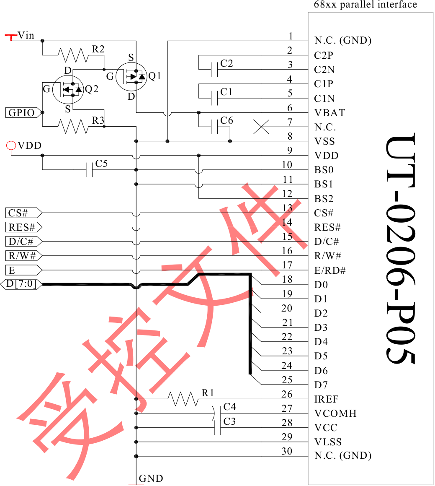

#### 3.3.1.2 **68XX-Series MPU Parallel Interface with Internal Charge Pump** 

特别提醒 **(Special Tips):** 主板设计务必加电子开关 , 否则 , 可能引起漏电流现象 

(When design main board, Please add Electronic Switch circuit, otherwise, will be caused leak current) 

<!-- Start of picture text -->
68xx parallel interface Vin 1 N.C. (GND) R2 2 S C2P C2 3 D C2N G Q1 4 C1P G Q2 D C1 5 C1N GPIO S 6 VBAT R3 C6 7 N.C. 8 VSS VDD 9 VDD C5 10 BS0 11 BS1 12 BS2 13 CS# CS# 14 RES# RES# 15 D/C# D/C# 16 R/W# R/W# 17 E E/RD# 18 D[7:0] D0 19 D1 20 D2 21 D3 22 D4 23 D5 24 D6 25 D7 R1 26 IREF C4 27 VCOMH C3 28 VCC 29 VLSS 30 N.C. (GND) GND UT-0206-P05 <!-- End of picture text -->

#### **Recommended Components:** 

C1, C2: 1μF / 16V, X5R C3: 2.2μF C4: 4.7μF / 16V, X7R C5, C6: 1μF R1: 910kΩ, R1 = (Voltage at IREF - VSS) / IREF R2, R3: 47kΩ Q1: FDN338P Q2: FDN335N **Notes:** 

VDD: 1.65~3.3V, it should be equal to MPU I/O voltage. Vin: 3.5~4.2V 

* VBAT will be connected to VDD when VCC be connected to external source (12V), R1 should be 

replaced as **910 kΩ** . 

