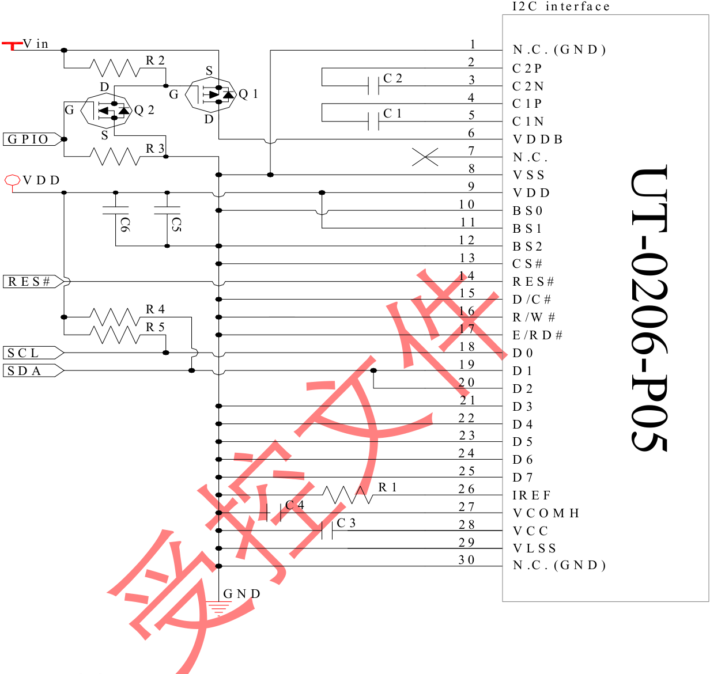

#### 3.3.5.2 **I****2** **C Interface with Internal Charge Pump** 

特别提醒 **(Special Tips):** 主板设计务必加电子开关 , 否则 , 可能引起漏电流现象 

(When design main board, Please add Electronic Switch circuit, otherwise, will be caused leak current) 

<!-- Start of picture text -->
I2 C in te r fa c e V in 1 N .C . (G N D ) R 2 2 S C 2 P C 2 3 D C 2 N G Q 1 4 C 1 P G Q 2 D C 1 5 C 1 N G P I O S 6 V D D B R 3 7 N .C . 8 V S S V D D 9 V D D 1 0 B S 0 1 1 B S 1 1 2 B S 2 1 3 C S # 1 4 R E S # R E S # 1 5 D /C # R 4 1 6 R /W # R 5 1 7 E /R D # 1 8 S C L D 0 1 9 S D A D 1 2 0 D 2 2 1 D 3 2 2 D 4 2 3 D 5 2 4 D 6 2 5 D 7 R 1 2 6 IR E F C 4 2 7 V C O M H C 3 2 8 V C C 2 9 V L S S 3 0 N .C . (G N D ) G N D C6 C5 UT-0206-P05 <!-- End of picture text -->

**Recommended Components:** C1, C2: 1μF / 16V, X5R C3: 2.2μF / 16V, X7R C4: 4.7μF / 16V, X7R C5, C6: 1μF / 6.3V, X5R R1: 620kΩ, R1 = (Voltage at IREF - VSS) / IREF R2, R3: 47kΩ R 4 , R 5 : 4 . 7kΩ Q1: FDN338P Q2: FDN335N **Notes:** VDD: 1.65~3.3V, it should be equal to MPU I/O voltage. Vin: 3.5~4.2V 

* VBAT will be connected to VDD when VCC be connected to external source (9V), R1 should be replaced as 62 **0 kΩ** . 

