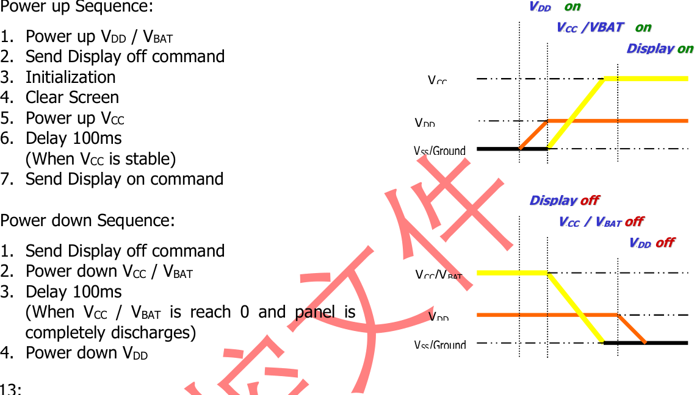

### **4. Functional Specification** 

#### **4.1 Commands** 

Refer to the Technical Manual for the SSD1315 

#### **4.2 Power down and Power up Sequence** 

To protect OEL panel and extend the panel life time, the driver IC power up/down routine should include a delay period between high voltage and low voltage power sources during turn on/off.  It gives the OEL panel enough time to complete the action of charge and discharge before/after the operation. 

#### 4.2.1 Power up Sequence: 

<!-- Start of picture text -->
V B DD B on V B CC B /VBAT on 1. Power up VDD / VBAT Display on 2. Send Display off command 3. Initialization  VBCC 4. Clear Screen 5. Power up VCC VBDD 6. Delay 100ms V BSSB/Ground (When VCC is stable) 7. Send Display on command Display off 4.2.2 Power down Sequence:  V B CC B / V B BAT off 1. Send Display off command  V B DD B off 2. Power down VCC / VBAT V CC/V BAT 3. Delay 100ms (When VCC / VBAT is reach 0 and panel is  V DD completely discharges) V SS/Ground 4. Power down VDD <!-- End of picture text -->

#### 4.2.2 Power down Sequence: 

Note 13: 

- 1) Since an ESD protection circuit is connected between VDD and VCC inside the driver IC, VCC becomes lower than VDD whenever VDD is ON and VCC is OFF. 

- 2) VCC / VBAT should be kept float (disable) when it is OFF. 

- 3) Power Pins (VDD, VCC, VBAT) can never be pulled to ground under any circumstance. 

- 4) VDD should not be power down before VCC / VBAT power down. 

#### **4.3 Reset Circuit** 

When RES# input is low, the chip is initialized with the following status: 

1. Display is OFF 

2. 12864 Display Mode 

3. Normal segment and display data column and row address mapping (SEG0 mapped to column address 00h and COM0 mapped to row address 00h) 

4. Shift register data clear in serial interface 

5. Display start line is set at display RAM address 0 

6. Column address counter is set at 0 

7. Normal scan direction of the COM outputs 

8. Contrast control register is set at 7Fh 

9. Normal display mode (Equivalent to A4h command) 

