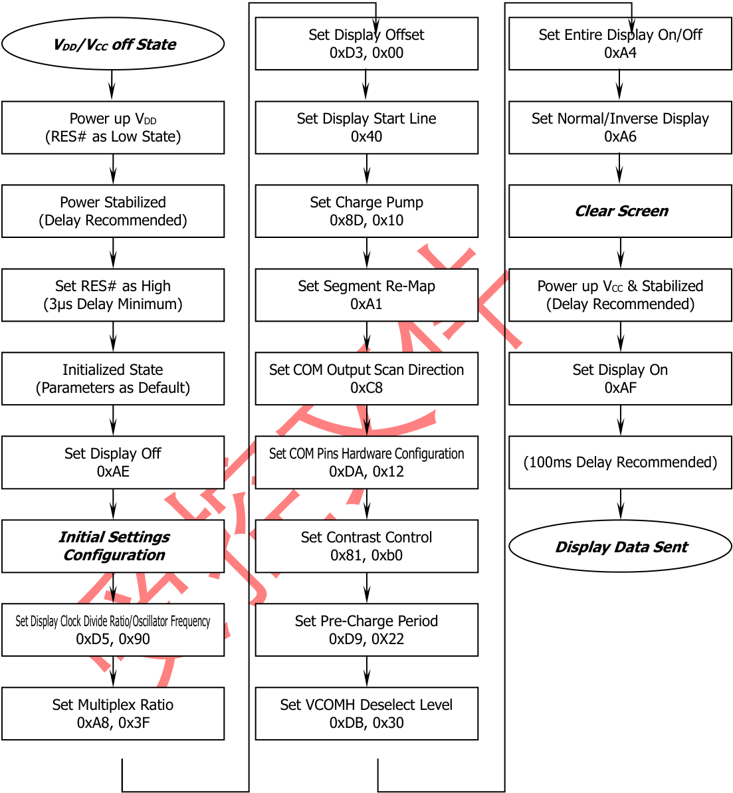

#### **4.4 Actual Application Example** 

Command usage and explanation of an actual example 

#### 4.4.1 VCC Supplied Externally 

<Power up Sequence> 

<!-- Start of picture text -->
Set Display Offset Set Entire Display On/Off VDD/VCC off State 0xD3, 0x00 0xA4 Power up VDD Set Display Start Line Set Normal/Inverse Display (RES# as Low State)  0x40 0xA6 Power Stabilized Set Charge Pump Clear Screen (Delay Recommended)  0x8D, 0x10 Set RES# as High Set Segment Re-Map Power up VCC & Stabilized (3μs Delay Minimum)  0xA1 (Delay Recommended) Initialized State Set COM Output Scan Direction Set Display On (Parameters as Default)  0xC8 0xAF Set Display Off Set COM Pins Hardware Configuration (100ms Delay Recommended) 0xAE  0xDA, 0x12 Initial Settings  Set Contrast Control Display Data Sent Configuration  0x81, 0xb0 Set Display Clock Divide Ratio/Oscillator Frequency Set Pre-Charge Period 0xD5, 0x90  0xD9, 0X22 Set Multiplex Ratio Set VCOMH Deselect Level 0xA8, 0x3F  0xDB, 0x30 <!-- End of picture text -->

If the noise is accidentally occurred at the displaying window during the operation, please reset the display in order to recover the display function. 

