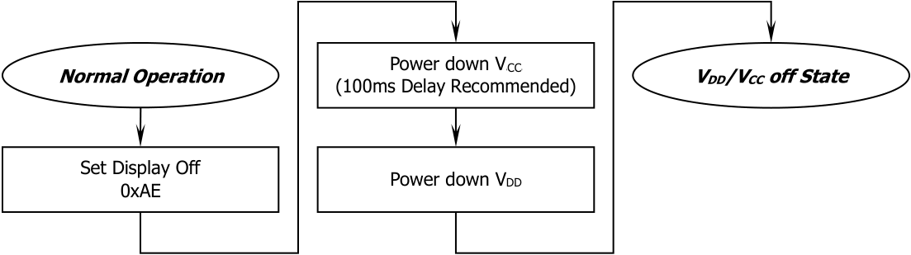

<Power down Sequence> 

<!-- Start of picture text -->
Normal Operation Power down VBCCB  VDD/VCC off State (100ms Delay Recommended) Set Display Off 0xAE  Power down VDD <!-- End of picture text -->

<Entering Sleep Mode> 

**Normal Operation** Power down VCC Set Display Off 0xAE **Sleep Mode** <Exiting Sleep Mode> Set Display On **Sleep Mode** 0xAF **Normal Operation** Power up VCC & Stabilized (100ms Delay Recommended) (Delay Recommended) External setting { RES=1; delay(1000); RES=0; delay(1000); RES=1; delay(1000); write_i(0xAE);    /*display off*/ write_i(0x00);    /*set lower column address*/ write_i(0x10);    /*set higher column address*/ write_i(0x40);    /*set display start line*/ write_i(0xB0);    /*set page address*/ write_i(0x81);    /*contract control*/ write_i(0xb0);    /*128*/ 

