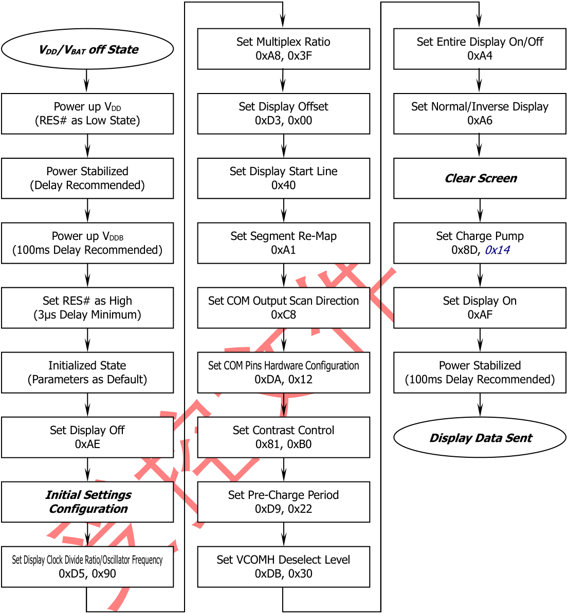

#### 4.4.2 VCC Generated by Internal DC/DC Circuit 

<Power up Sequence> 

<!-- Start of picture text -->
Set Multiplex Ratio Set Entire Display On/Off VDD/VBAT off State 0xA8, 0x3F 0xA4 Power up VDD Set Display Offset Set Normal/Inverse Display (RES# as Low State)  0xD3, 0x00 0xA6 Power Stabilized Set Display Start Line Clear Screen (Delay Recommended)  0x40 Power up VDDB Set Segment Re-Map Set Charge Pump (100ms Delay Recommended) 0xA1 0x8D, 0x14 Set RES# as High Set COM Output Scan Direction Set Display On (3μs Delay Minimum) 0xC8 0xAF Initialized State Set COM Pins Hardware Configuration Power Stabilized (Parameters as Default) 0xDA, 0x12 (100ms Delay Recommended) Set Display Off Set Contrast Control 0xAE 0x81, 0xB0 Display Data Sent Initial Settings  Set Pre-Charge Period Configuration 0xD9, 0x22 Set Display Clock Divide Ratio/Oscillator Frequency Set VCOMH Deselect Level 0xD5, 0x90 0xDB, 0x30 <!-- End of picture text -->

If the noise is accidentally occurred at the displaying window during the operation, please reset the display in order to recover the display function. 

