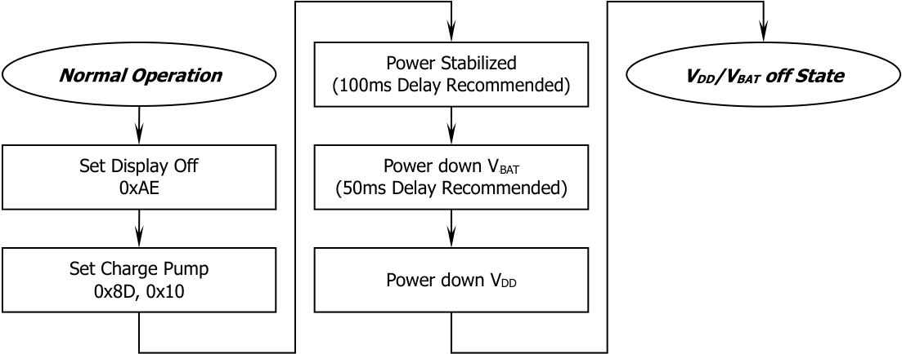
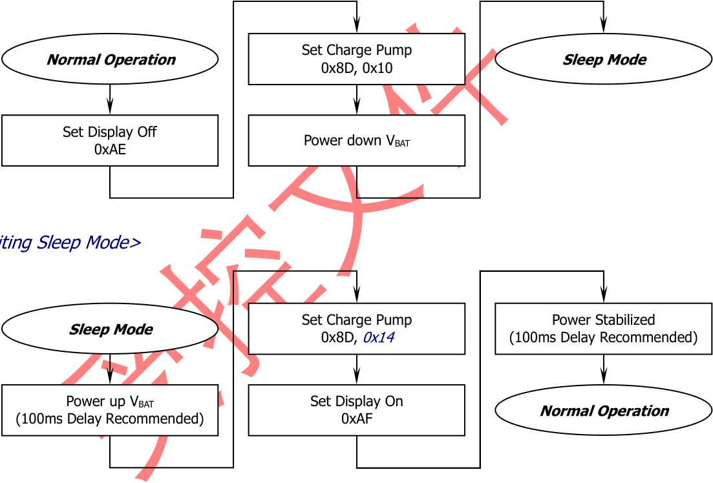

<Power down Sequence> 

<!-- Start of picture text -->
Power Stabilized Normal Operation VDD/VBAT off State (100ms Delay Recommended) Set Display Off Power down VBBAT 0xAE (50ms Delay Recommended) Set Charge Pump 0x8D, 0x10 Power down VDD <!-- End of picture text -->

#### <Entering Sleep Mode> 

<!-- Start of picture text -->
Set Charge Pump Normal Operation Sleep Mode 0x8D, 0x10 Set Display Off 0xAE Power down VBAT <Exiting Sleep Mode> Set Charge Pump Power Stabilized Sleep Mode 0x8D, 0x14 (100ms Delay Recommended) Power up VBAT Set Display On (100ms Delay Recommended) 0xAF Normal Operation <!-- End of picture text -->

<Exiting Sleep Mode> 

### Internal  setting （ Charge pump ） 

{ 

RES=1; delay(1000); RES=0; delay(1000); RES=1; delay(1000); write_i(0xAE);    /*display off*/ write_i(0x00);    /*set lower column address*/ write_i(0x10);    /*set higher column address*/ 

