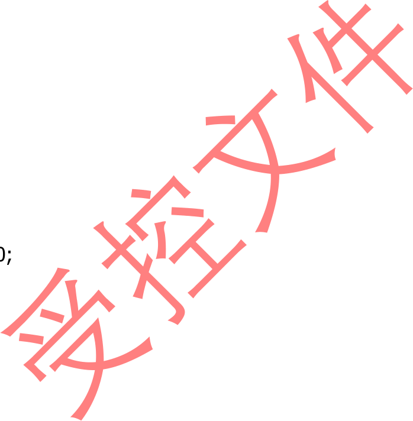

CS=0; 

da=ins; 

for(j=0;j<8;j++) 

{ 

m=da; 

SCL=0; 

m=m&0x80; 

if(m==0x80) 

{ SDA=1; 

} 

else 

{ 

SDA=0; 

} 

da=da<<1; 

SCL=1; 

} 

CS=1; 

} 

void write_d(unsigned char  dat) 

{ 

unsigned char  m,da; 

