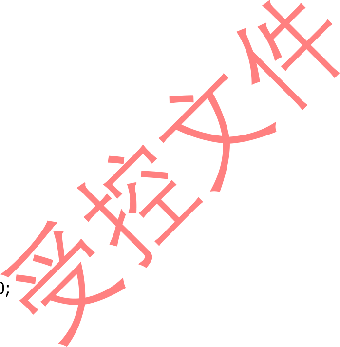

unsigned int j; 

DC=1; 

CS=0; 

da=dat; 

for(j=0;j<8;j++) 

{ 

m=da; 

SCL=0; 

m=m&0x80; 

if(m==0x80) 

{ 

SDA=1; 

} 

else 

{ SDA=0; } 

da=da<<1; 

SCL=1; 

} 

CS=1; 

} 

void delay(unsigned int i) 

