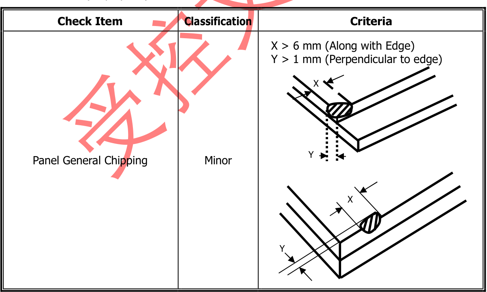

### **6. Outgoing Quality Control Specifications** 

#### **6.1 Environment Required** 

Customer’s test & measurement are required to be conducted under the following conditions: Temperature: 23 ± 5°C Humidity: 55 ± 15% RH Fluorescent Lamp: 30W Distance between the Panel & Lamp: ≥ 50cm Distance between the Panel & Eyes of the Inspector: ≥ 30cm Finger glove (or finger cover) must be worn by the inspector. Inspection table or jig must be anti-electrostatic. 

#### **6.2 Sampling Plan** 

Level II, Normal Inspection, Single Sampling, MIL-STD-105E 

#### **6.3 Criteria & Acceptable Quality Level** 

|**Partition**|**AQL**|**Definition**|
|---|---|---|
|Major|0.65|Defects in Pattern Check (Display On)|
|Minor|1.0|Defects in Cosmetic Check (Display Off)|

#### 6.3.1 Cosmetic Check (Display Off) in Non-Active Area 

<!-- Start of picture text -->
Check Item  Classification Criteria X > 6 mm (Along with Edge) Y > 1 mm (Perpendicular to edge) X Y Panel General Chipping  Minor X Y <!-- End of picture text -->

